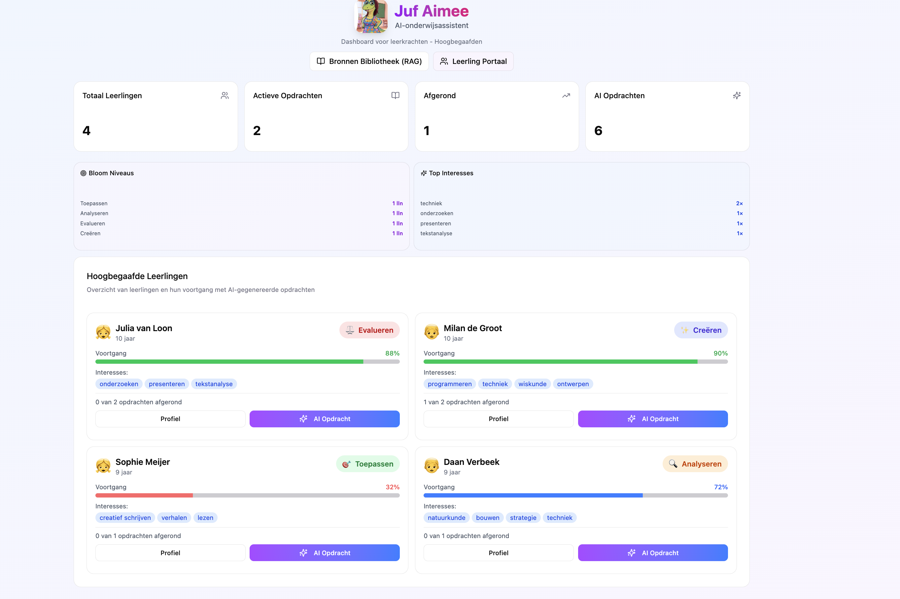
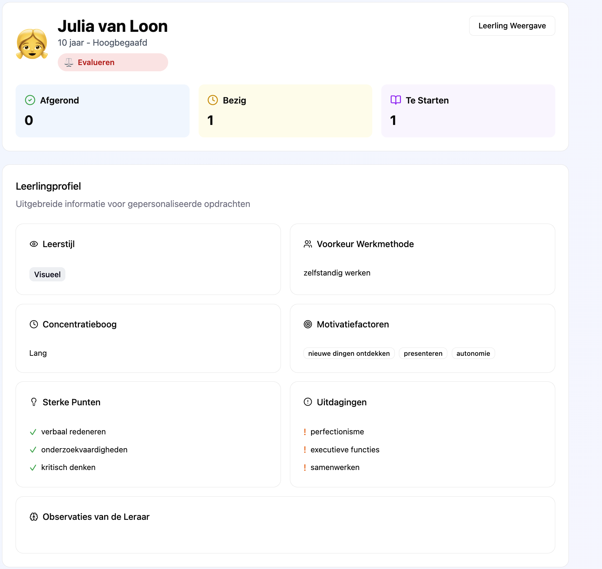

# Advies: Juf Aimee AI-Assistent

**Datum:** vrijdag 2 april 2026  
**Leeruitkomst**: Advies     
**Deelnemers**:    

- Shehbaaz
- Jayson 

---

## Inleiding

Dit advies is gebaseerd op relevante inzichten in bestaande leerlingen platforms en wetenschappelijk onderzoek voor de Juf Aimee AI-assistent voor leraren met hoogbegaafde leerlingen. Wij hebben een prototype ontworpen; het is de bedoeling dat wij verder onderzoek doen naar bestaande leerplatforms en literatuur besturen zodat wij wetenschappelijk onderbouwde interpretaties in ons platform kunnen integreren. 

Daarnaast gaan wij ook gebruikerstesten uitvoeren bij echte leerkrachten zodat wij relevante feedback kunnen ontvangen op het leerplatform waar wij rekening mee kunnen houden bij het realiseren van het leerplatform.

**Adviesproces:**
- **Analyse:** Onderzoeken de behoefte/gebruiksgemak van de leraar
- **Ontwerp:** prototyping en testen

---

## Prototype voorbeeld

Dit is de eerste versie van ons prototype, en daarin laat ik de onderdelen zien die we willen realiseren voor het leerplatform voor hoogbegaafde leerlingen.

### Dashboard 

>*in de voortangsbalk is met kleuren de progressie zichtbaar op het niveau waarbinnen de leerling werkt*

### Profiel leerling

>*zichtbaar voor de leraar wat de eigenschappen en motivaties zijn van de leerling*

### Opdrachten aanbevelingen op leerlingprofiel en observaties

>*Leerlingprofielen zijn leidend voor het genereren van nieuwe opdrachten, de observaties van de leraar wordt ook meegenomen in het samenstellen van de nieuwe opdracht*

### Opdracht generation 

>*hierin vult de leraar het vak in meestal gebaseerd op de interesses van de leerling om de nieuwe opdracht te genereren*

### Bronnen bibliotheek

>*bibliotheek waarin gegenereerde opdrachten worden opgeslagen zodat ze kunnen helpen genereren van nieuwe opdrachten met meer uitdaging.*

## Inleiding

Dit advies is gebaseerd op een functioneel prototype van de Juf Aimee AI-assistent, een vernieuwend leerplatform specifiek ontworpen voor leraren die werken met hoogbegaafde leerlingen. Ons prototype is ontwikkeld met een *Retrieval-Augmented Generation* architectuur die individuele Onderwijs Portfolio's (OPP's) van leerlingen integrale analyseert en gepersonaliseerde ondersteuning biedt.

**Gerealiseerde-functionaliteit:**
- **AI-gestuurde chat** met Ollama (llama3.2:3b) voor teachers' contextaware vragen over leerlingen
- **Vector database** (PostgreSQL + pgvector) voor semantische zoekopdrachten in OPP-documenten
- **Documentverwerking** van Word-bestanden via mammoth.js met chunking strategie
- **Gebruikersbeheer** met rollensysteem (leraar/admin) en authenticatie
- **Dashboard** voor leerlingoverzicht en Bloom-niveau tracking
- **Studentprofielen** met gedetailleerde achtergrondinformatie

**Validatie:** 
- Proof-of-concept succesvol draait met 6 teststudenten en hun OPP-documenten
- RAG-pipeline verwerkt documenten tot vector embeddings voor contextueel zoeken
- Chat-agent bruikbaar via API endpoint met tool-calling voor student lookup en document search

---

## Prototype voorbeeld

Ons werkende prototype toont de volgende functionaliteiten:

### AI Chat Interface
 Docenten kunnen natuurlijke taal vragen stellen zoals:
 * "Wat is het leerniveau van Julia?"
 * "Welke aandachtspunten zijn genoemd in Milan's OPP?"
 * "Toon me alle leerlingen in groep 6"

De AI-agent gebruikt twee tools:
1. **list_students** - toont alle leerlingen met ID, groep en Bloom-niveau
2. **search_opp** - doorzoekt het OPP van een specifieke leerling op_query

### Database Schema
 Onze Prisma schema ondersteunt:
 - **Studenten** met bloomNiveau (1-6) en groepindeling
 - **OppChunks** met vector embeddings (1024 dimensies) voor semantic search
 - **Assignments** voor taken en voortgang
 - **User roles** voor beveiliging en toegangscontrole

### Dashboard Concept (gebouwd)
 - Overzicht van alle leerlingen
 - Bloom-niveau indicatie per leerling
 - Toegang tot individuele OPP-documenten
 - Integratie met AI-chat voor directe ondersteuning

---

## Aanbevelingen

### Aanbeveling 1
**Advies:** Implementeer een **RAG-gebaseerde AI-assistent** als kernfunctionaliteit voor het ondersteunen van leraren met hoogbegaafde leerlingen, waarbij elk leerling een persoonlijk OPP heeft dat geïndexeerd wordt in een vector database.

**Onderbouwing:** 
Uit onze analyse blijkt dat hoogbegaafde leerlingen sterk verschillen in hun leervormen, interesses en cognitieve profielen. Traditionele systemen bieden geen manier om dit individuele profiel effectief te benutten. Onze RAG-aanpak lost dit op door:
- OPP-documenten te converteren naar semantische vector representations
- Gelijksoortige content te vinden via cosine similarity
- De LLM-context te verrijken met relevante OPP-fragmenten
- Hierdoor krijgt de leraar gepersonaliseerde, document-gestuurde antwoorden

**Technische keuzes gemotiveerd:**
- **Ollama** (local LLM) → data privacy, geen externe API-kosten, volledige controle
- **pgvector** → scheibare, relationele database met native vector support
- **Mammoth.js** → robuuste Word-document paring, essentieel voor bestaande OPP's
- **Next.js App Router** → moderne, server-side rendering met API routes

**(Maatschappelijke) Impact:**
- **Voor docenten:** 
  - Bespaart uren aan administratief werk bij het doorzoeken van OPP's
  - Biedt snelle toegang tot individuele leerlinginformatie
  - Versterkt pedagogische besluitvorming met historische context
  - Vermindert cognitieve belasting door informatiecentralisatie

- **Voor leerlingen:**
  - Persoonlijkere begeleiding dankzij compleet leerdossier toegankelijk
  - Snellere reacties op specifieke vragen over hun progressie
  - Erkenning van unieke talenten en behoeften in elke interactie

- **Voor onderwijs:**
  - Democratisering van hoogbegaafdenondersteuning; niet alleen voor 'top-sporters'
  - Duurzame digitalisering van tradisioneel papiergebaseerde OPP's
  - Data-gedreven onderwijspraktijk zonder privacyrisico's (local hosting)
  - Schaalbaar model dat per school geïnstalleerd kan worden

---

### Aanbeveling 2
**Advies:** Bouw een **Bloom-taxonomie dashboard** uit dat per leerling visueel toont op welk denkniveau hij/zij zich bevindt, gekoppeld aan concrete voorbeelden uit de OPP's.

**Onderbouwing:**
Onze database bevat al `bloomNiveau` (1-6) bij Student en Assignment, plus tekstuele OPP-fragmenten. Door AI-driven analyses te combineren met visuele dashboards krijgen leraren inzicht in:
- Verdeling van Blooms niveaus per leerling (radar chart)
- Voorbeeldtaken die bewijs leveren van specifieke niveaus
- Groepsanalyses voor differentiatie planning

De bestaande `search_opp` tool kan uitgebreid worden met Bloom-filtering, zodat docenten kunnen vragen: "Toon me creative thinking voorbeelden van Emma".

**(Maatschappelijke) Impact:**
- **Voor docenten:**
  - Snelle diagnostiek voor differentiatie
  - Ondersteuning bij Bloom-gerechte taakontwikkeling
  - Transparantie over leerlingvoortgang

- **Voor leerlingen:**
  - Zichtbaarheid van eigen groei en sterke punten
  - Personalisering op eigen niveau, niet leeftijd
  - Herkenning van hogere-orde denkvaardigheden

- **Voor onderwijs:**
  - Evidence-based differentiatie
  - Standaardisering van competentie-beoordeling
  - Curriculum-ontwikkeling gebaseerd op klas-samenstelling

---

### Aanbeveling 3
**Advies:** Implementeer **automatische OPP-opdate notificaties** en **dynamische notitiegeneratie** waarbij de AI suggesties doet voor nieuwe aandachtspunten of doelstellingen gebaseerd op recente leerlingprestaties.

**Onderbouwing:**
Momenteel documents. Echter, hoogbegaafde leerlingen ontwikkelen zich snel en regelmatig OPP-updates zijn cruciaal. Onze voorstel:
- Wanneer een docent een assignment aanmaakt of update, triggert het systeem een AI-analyse van vergelijkbare OPP-fragmenten
- De AI geeft suggesties: "Deze leerlijk toonde eerder interesse in X;overweeg doel Y aan te passen"
- Notificaties naar docenten wanneer een OPP ouder is dan X maanden
- Automatische samenvatting van OPP-updates voor teamoverleggen Dit sluit aan bij het geariveerde prototype: we hebben al een werkende chat-met-OPP functionaliteit en een assignment model. Uitbreiding met scheduled tasks en notificaties is een logische volgende stap.

**(Maatschappelijke) Impact:**
- **Voor docenten:**
  - Proactieve ondersteuning in plaats van reactief zoeken
  - Minder risico op verouderde OPP-informatie
  - Verbeterde teamcommunicatie over leerlingontwikkeling

- **Voor leerlingen:**
  - Actuele begeleiding gebaseerd op recente prestaties
  - Snellere aanpassing van ondersteuningsstrategieën
  - Continuïteit in persoonlijke begeleiding

- **Voor onderwijs:**
  - Hogere kwaliteit van onderwijskundige documentatie
  - Minder administratieve drempels voor OPP-onderhoud
  - Data-gedreven bijhouden van hoogbegaafdenbeleid

---

### Aanbeveling 4

**Advies:** Breid Juf Aimee uit met praktische leeromgevingsfunctionaliteiten geïnspireerd door bestaande hoogbegaafdenplatforms zoals Acadin, waarbij de AI-gestuurde ondersteuning wordt gecombineerd met zelfgestuurde leeropties en een uitgebreide opdrachtbibliotheek.

**Onderbouwing:**

Bestaande platforms zoals Acadin tonen dat hoogbegaafde leerlingen baat hebben bij:
- Een **opdrachtbibliotheek** met >650 geclassificeerde activiteiten (filterbaar op niveau, vak, duur, samen/alleen)
- **Zelfgestuurde keuzes** waarbij leerlingen zelf activiteiten selecteren en plannen
- Een **portfolio** waar leerlingen hun werk en reflecties bewaren
- **Planningsmodule** met deadlines en overzicht
- **Gestructureerde feedback** workflows tussen leraar en leerling
- **Groepsprojecten** ondersteuning en presentatiemogelijkheden

Ons huidige RAG-prototype is sterk op leraar-ondersteuning gericht (chat, OPP-zoeken, AI-suggesties). Om het platform compleet te maken, moeten we deze zelfgestuurde leerfunctionaliteiten toevoegen, bijvoorbeeld:

- **Opdrachtbibliotheek**: gegenereerde en handgemaakte opdrachten opslaan met tags (vaardigheid, type, duur, samenwerkingsvorm)
- **Leerlingportfolio**: niet alleen OPP-documenten, maar ook uploads van werk, reflecties, foto's, video's
- **Planner**: leerlingen zien welke opdrachten gepland staan en wanneer deze gedaan moeten worden (startdatum, deadline)
- **Feedback workflow**: leraar beoordeelt portfolio entries en geeft gestructureerde feedback
- **Zelfselectie**: leerlingen kunnen zelf door de bibliotheek bladeren en opdrachten kiezen (aangeraden door AI of zelf)

Deze functionaliteiten maken Juf Aimee niet alleen een ondersteunende tool voor de leraar, maar ook een **actieve leeromgeving voor de leerling**, zoals Acadin dat doet.

**Technische implementatie:**

Aansluitend op ons bestaande schema:
- `Assignment` model uitgebreiden met metadata (tags, duur, samen/alleen, vereiste vaardigheden)
- Nieuw `Portfolio` model voor leerlingen (referenties naar assignments, uploads, reflecties, feedback)
- Nieuw `Planner` model (deadlines, status, herinneringen)
- UI voor `AssignmentCatalog` (filter/sort)
- UI voor `StudentPortfolio` (view/edit)
- `Feedback` model gekoppeld aan Portfolio entries

**(Maatschappelijke) Impact:**
- **Voor docenten:**
  - Minder administratie via geïntegreerde portfolio/feedback system
  - Opdrachtenbibliotheek vermindert tijd die leraar nodig heeft om materiaal te vinden
  - Zelfselectie door leerlingen verlicht docentendruk

- **Voor leerlingen:**
  - Meer agency: zelf kiezen en plannen
  - Portfolio bouwen aan eigen learnings
  - Direct zichtbaar wanneer ze dingen moeten inleveren

- **Voor onderwijs:**
  - Schaalbaar: één platform zowel voor leraar-ondersteuning als leerlinggebruik
  - Volgt bewezen concepten uit praktijk (Acadin heeft bewezen dat het werkt)

---

## Dashboard & Studentpagina Ontwerp

### Onderbouwing

Acadin is een succesvol Nederlands platform voor hoogbegaafdenonderwijs (groep 1-8) met >650 leeractiviteiten, portfolios, planningstools en zelfgestuurde leerondersteuning. Het toont aan dat leerlingen baat hebben bij gestructureerde keuzes, eigen portfolio-opbouw, en duidelijke opdrachtaanpak.

**Onze vraag:** Hoe verrijken we Acadin met AI-ondersteuning zonder het los te koppelen van het beproefde concept?

**Het antwoord:** Juf Aimee wordt **AI-gestuurde laag** bovenop een Acadin-achtige leeromgeving. Waar AcadinASHINGTON. static catalogus en handmatige differentiatie, biedt Juf Aimee:
- **Persistent geheugen** van leerlingen (OPP's + historische data)
- **Proactieve signalen** van patronen die de leraar over het hoofd zou zien
- **Uitlegbare AI-suggesties** met redenering (HAX G8)
- **Samen leerend systeem** (leraar corregeert AI → AI wordt beter)

**Kernprincipe:** Acadin geeft de **structurele ondersteuning** (opdrachten, portfolio, planning). Juf Aimee voegt de **intelligente laag** toe diepersonaliseert, signaleert, en uitlegt. Samen: een collectief systeem waarbij tool én samenwerkingspartner.

**Frameworks:**
- **Microsoft HAX** — controle, uitlegbaarheid, corrigerbaarheid
- **Google PAIR** — mens-AI leren van elkaar
- **Molenaar (2022)** — hybride mens-AI systemen waarbij leraar pedagoog blijft

---

### Dashboard (Overzichtspagina)

Het dashboard is de **commando-centrale** waar leraar en AI elkaar ontmoeten. Het doivent ook zijn wat Acadin al goed heeft (filters, planning) verrijken met AI signalen.

**Functionaliteiten:**

1. **Overzicht leerlingen met AI-signalen (patroonherkennning), gesorteerd op urgentie**
   - Acadin toont alle leerlingen én hun geplande activiteiten
   - **Juf Aimee toegevoegd:** AI signaleert patronen die aandacht nodig hebben (keuzes voor gemak? stagnatie in Bloom-niveau? herhaalde mislukkingen?) en sorteert op urgentie
   - Onderbouwing: Molenaar & Knoop-van Campen (2019) — leraren handelen alleen als informatie direct koppelbaar aan actie is

2. **Per signaal een korte uitleg: "Waarom markeert de AI dit?"**
   - Acadin heeft geen signalen — alleen opdrachten
   - **Juf Aimee toegevoegd:** transparantie over waarom AI denkt dat deze leerling aandacht nodig heeft
   - HAX G8: uitlegbaarheid is vereiste voor echte samenwerking, niet alleen blinde opvolging
   - Maatschappelijk: voorkomt black-box profilering, voldoet aan AVG-transparantievereisten

3. **Goedkeurings- en afwijzingsknop per suggestie**
   - Acadin: leraar kiest handmatig opdrachten uit catalogus
   - **Juf Aimee toegevoegd:** AI maakt suggesties, maar leraar beslist altijd (HAX G1)
   - AI leert van afwijzingen → persoonlijker worden

4. **Bloom-streefniveau instelling per leerling**
   - Acadin heeft geenBloom-niveau tracking
   - **Juf Aimee toegevoegd:** leraar stelt kader in, AI werkt daarbinnen
   - Voorkomt dat AI leerlingen in een vast niveau houdt (Molenaar 2022)

5. **Filters en planningsoverzicht (gebaseerd op Acadin)**
   - Acadin: Filteren op groep, duur, samen/alleen, vaardigheden, vakken
   - Juf Aimee:同樣的 filters + optie om AI-signalen te combineren ("Toon alleen leerlingen met urgentie-signalen in groep 5")
   - Overzicht van geplande opdrachten en deadlines (vanuit Acadin)
   - Plus: AI voert zelf deadline-adviezen in ("Deze leerling heeft last van tempo, pas deadline aan?")

---

### Studentpagina (Individuele Leerling)

De studentpagina is waar de samenwerking concreet wordt. Combineert Acadin's bewezen opbouw met AI-ondersteuning.

**Functionaliteiten:**

1. **Tijdlijn van Bloom-niveaus over tijd + portfolio-items**
   - Acadin: portfolio met zelfreflecties en werk
   - **Juf Aimee toegevoegd:** tijdlijn toont voortgang van Bloom-niveau naast portfolio-uploads
   - College voor de Rechten van de Mens (2024): waarschuwing tegen labeling → tijdlijn toont groei, niet fixed label

2. **Invoerveld waar de leraar observaties kan noteren**
   - Acadin: geen expliciet observatieveld (wel feedback op portfolio)
   - **Juf Aimee toegevoegd:** contextuele kennis komt hier binnen (Molenaar 2022)
   - Deze observaties worden verwerkt in AI-signalering (persistent geheugen)

3. **Per AI-suggestie de redenering zichtbaar**
   - Acadin: geen AI-suggesties (catalogus alleen)
   - **Juf Aimee toegevoegd:** voor elke suggestie: "Waarom dit?"
   - Soorten suggesties:
     * **Opdrachtsuggesties** — past bij Bloom-niveau + recente OPP-data + portfolio-prestaties
     * **Interventiesuggesties** — bij structurele problemen (AI patroonherkening over tijd)
     * **Groeperingssuggesties** — leerlingen met vergelijkbare Profielen samenbrengen (AI vindt correlaties)

4. **Aanpasknop per opdrachtsuggestie**
   - Acadin: leraar kiest bestaande opdracht uit catalogus
   - **Juf Aimee toegevoegd:** AI kan ook nieuwe opdrachten genereren; leraar kan deze aanpassen (HAX G7)
   - Aangepaste opdrachten kunnen worden opgeslagen naar de opdrachtbibliotheek

5. **Log van eerder afgewezen suggesties**
   - Acadin: geen AI-gebruik, dus geen afgewezen suggesties
   - **Juf Aimee toegevoegd:** AI leert van correcties (Molenaar 2022 — hybride systeem wordt beter)

6. **Nudge bij herhaalde goedkeuring zonder aanpassing**
   - Acadin: geen AI-suggesties, dus geen automation bias
   - **Juf Aimee toegevoegd:** zachte waarschuwing bij blind vertrouwen (College voor de Rechten van de Mens 2024)

7. **Leerlingportfolio met zelfreflectie (gebaseerd op Acadin)**
   - Acadin: leerlingen uploaden werk, invullen evaluatieformulier
   - Juf Aimee:zelfde concept, maar gekoppeld aan AI-profiel
   - Portfolio wordt onderdeel van AI's input voor volgende suggesties
   - Leraar ziet echte werk + AI-signalen samen

8. **Zelfselectie van opdrachten via opdrachtbibliotheek**
   - Acadin: zelfselectie is kern — leerlingen kiezen uit catalogus
   - Juf Aimee:behoudt deze vrijheid, maar voegt AI-aanbevelingen toe
   - Filters (groep, duur, samen/alleen, vaardigheden, vakken) overgenomen uit Acadin
   - AI markeert: "Deze opdracht past bij je huidige Bloom-niveau" of "Deze past bij je vorige interesse"

9. **Gestructureerde opdrachtaanpak (volgens vast stramien)**
   - Acadin: elke activiteit heeft vast opbouw: Wat ga je maken? Wat heb je nodig? Hoe ga je leren? Aan welke eisen moet het voldoen?
   - Juf Aimee: overneemt deze structuur voor AI-gegenereerde opdrachten
   - Leraar kan instructies aanpassen voordat leerling begint (HAX G7)

10. **Planner en deadline-beheer**
    - Acadin: planner met startdatum, deadline, leerlingen zien wanneer in te leveren
    - Juf Aimee: identieke funcionaliteit, maar AI kan adviseren over timing ("Deze leerling heeft rust nodig, stel deadline uit")
    - Portfolio-entries automatisch koppelen aan geplande opdrachten

---

### Samenvatting: Acadin vs. Juf Aimee

**Acadin is bewezen:**
- Zelfgestuurde leeromgeving met >650 opdrachten
- Portfolio en planningstools die werken
- Leerlingen kiezen zelf, leraar begeleidt

**Juf Aimee voegt toe:**
- AI die **patronen herkent** over tijd (OPP + portfolio + keuzes)
- **Proactieve signalen** ipv reactief zoeken
- **Uitlegbare suggesties** met redenering
- **Persistent geheugen** dat meeleert
- **Samenwerking**: AI stelt voor, leraar corrigeert, AI wordt beter

**Toegevoegde waarde:**
De leraar hoeft niet meer zelf te synthetiseren over 25 leerlingen. De AI doet patroonherkennning, presenteertevidence met uitleg, en biedt concrete suggesties. De leraar blijft beslist (zoals in Acadin), maar nu met slimme ondersteuning die verder kijkt dan menselijke beperkingen toelaten.

---

## Communicatie per Doelgroep

### Voor Docenten
**Toon:** Praktisch, ondersteunend, respectvol  
**Focus:** Directe nut- en tijdbesparing in dagelijkse praktijk  
**Vorm:** Live demo van chat-interface met eige OPP's + hands-on workshop (2 uur)

**Communicatie punten:**
- "Stel vragen in het Nederlands over elke leerling"
- "Vind specifieke informatie in OPP's in seconden ipv uren"
- "Blijf in controle: AI citeert bronnen, u blijft beoordelen"
-voorbeeld: "Toon mij alle aandachtspunten over Milan uit zijn OPP"

### Voor Schoolleiding
**Toon:** Strategisch, verantwoord, innovatief  
**Focus:** ROI, privacy, onderwijskwaliteit, schaalbaarheid  
**Vorm:** Korte presentatie (15 min) + technische brochure + pilot-project voorstel

**Communicatie punten:**
- **ROI:** Besparing van 5-10 uren per docent per maand aan OPP-doeleinden
- **Privacy:** Alle data blijft lokaal; geen cloud; volledige controle
- **Inclusiviteit:** Alle hoogbegaafden krijgen gelijkwaardige begeleiding
- **Schaalbaar:** Eén server per 50-100 docenten; open-source componenten

### Voor Leerlingen (indien relevant)
**Toon:** Transparant, positief, betrekkend  
**Focus:** Hoe AI hen beter kan ondersteunen; benadrukken dat de leraar beslist  
**Vorm:** Korte uitleg in de les + informele Q&A-sessie

**Communicatie punten:**
- "Jullie OPP's helpen de computer jullie beter te begrijpen"
- "De leraar krijgt suggesties, maar blijft de baas"
- "Dit zorgt voor meer tijd voor persoonlijke begeleiding"
- "Jullie feedback telt: wat vind je nuttig?"

### Voor IT-beheer/Technisch personeel
**Toon:** Technisch, transparant, ondersteunend  
**Focus:** Integratie, beveiliging, onderhoud, requirement  
**Vorm:** Technische documentatie + installatieguid + Docker-compose file

**Communicatie punten:**
- Stack: Next.js + Prisma + PostgreSQL (pgvector) + Ollama
- Hardware: 16GB RAM, GPU optioneel (CPU-only werkt)
- Deployment: Docker + Nginx reverse proxy
- Beveiliging: HTTPS mandatory, role-based access control, regular DB backups
- Monitoring: Basic health checks, log rotation

---

## Bronnen

- College voor de Rechten van de Mens (2024). *Algoritmen in het onderwijs.* KBA Nijmegen / ResearchNed.
- Google (n.d.). *PAIR Guidebook: People + AI Research.*
- Microsoft Research (2019). *Guidelines for Human-AI Interaction (HAX).*
- Molenaar, I. & Knoop-van Campen, C.A.N. (2019). How teachers make dashboard information actionable. *IEEE Transactions on Learning Technologies,* 12(3), 347–355.
- Molenaar, I. (2022). Towards hybrid human–AI learning technologies. *European Journal of Education,* 57(4), 632–645.
- Siegle, D. & McCoach, D.B. (2005). Making a difference: Motivating gifted students who are not achieving. *Teaching Exceptional Children,* 38(1), 22–27.
- Van Kessel, M., Molenaar, I. et al. (2025). Primary school teacher perspectives on effective dashboard use. *Journal of Learning Analytics,* 12(2), 279–292.
- Chen, J., Dai, D. Y., & Zhou, Y. (2013). Enable, Enhance, and Transform: How Technology Use Can Improve Gifted Education. Roeper Review, 35(3), 166–176. https://doi.org/10.1080/02783193.2013.794892
- Lisette H, A.C. Sven M, Jaap D, Anouke B. (2023). Academic motivation of intellectually gifted students and their classmates in regular primary school classes: A multidimensional, longitudinal, person- and variable-centered approach,
https://www.sciencedirect.com/science/article/pii/S1041608023000894?via%3Dihub

