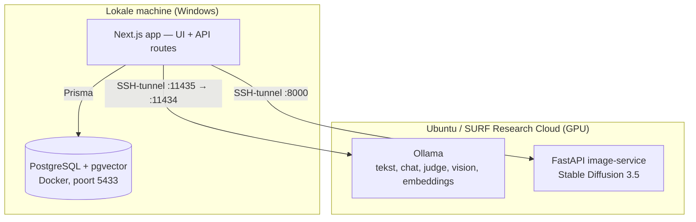
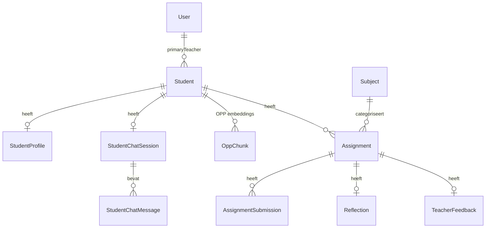

# Technische overdracht — Juf Aimee

> **Voor:** het ontwikkelteam (ICT) dat dit project overneemt.
> **Doel:** in één document weten *wat er is gebouwd*, *hoe het technisch in elkaar zit*, *waar wij zijn geëindigd* en *welke valkuilen we zijn tegengekomen*.
> **Lees hier eerst bij:** het [strategische advies over de AI-oplossing](advies-ai-oplossing.md) (het *waarom* en de keuzes) en de [suggestie voor de werkwijze & vervolgwerk](backlog-volgende-team.md) (hoe je het kunt aanpakken).
> **Opgesteld door:** Team Juf Aimee (Shehbaaz, Jayson, Mazen, Ruben) — Studio RAAI, HvA.

---

## 1. Lees dit eerst (samenvatting in 1 minuut)

**Juf Aimee** is een full-stack webapplicatie (Next.js) die leraren in het primair onderwijs helpt om **gepersonaliseerde verrijkingsopdrachten** te genereren voor **hoogbegaafde leerlingen**. De personalisatie gebeurt op basis van het **OPP** (Ontwikkelingsperspectiefplan) van de leerling. Alle AI draait **lokaal/zelf-gehost via Ollama** (geen OpenAI/cloud-LLM), met een **RAG/RAS-pipeline** bovenop een **PostgreSQL-database met pgvector**. De kwaliteit van elke gegenereerde opdracht wordt bewaakt door een **LLM-as-judge**.

De drie pijlers van het project zijn:

1. **Verantwoorde AI** — de leraar houdt altijd de eindregie; de AI adviseert en onderbouwt, maar beslist niet.
2. **Personalisatie** — opdrachten zijn geworteld in het volledige leerlingprofiel (OPP + portfolio).
3. **Lokaal & privacy-vriendelijk** — gevoelige leerlinggegevens verlaten de eigen infrastructuur niet.

!!! warning "Drie dingen die je meteen moet weten"
    1. **`web/CLAUDE.md` is verouderd** en beschrijft een oudere architectuur (modelnamen, mapindeling). Vertrouw dít document en de code, niet die file.
    
    2. **Er staat een geheim in de repo.** `model.env` bevat een echte Hugging Face-token. Die moet ingetrokken en verwijderd worden (zie [§8](#8-beveiliging-en-privacy)).

---

## 2. Wat is er gebouwd? (functioneel overzicht)

| Functie | Wat het doet | Status |
|---|---|---|
| **Opdrachtgeneratie (tekst)** | Genereert een verrijkingsopdracht uit OPP + portfolio, met Bloom-niveau en onderbouwing | ✅ Werkend |
| **Meerkeuzevraag-generatie** | Twee-stappen pipeline (Planner → Coder) die een gevalideerde MC-vraag oplevert | ✅ Werkend |
| **RAS-generatie** | Uitgebreide opdracht met portfolio, feedback en reflecties als context | ✅ Werkend (zie kanttekening §7) |
| **LLM-as-judge** | Beoordeelt elke opdracht op 7 criteria; kan automatisch laten hergenereren | ✅ Werkend |
| **Tekening-/beeldanalyse** | Vision-model (LLaVA) leest een geüploade tekening en geeft feedback | ✅ Werkend (prototype) |
| **Afbeeldingsgeneratie** | Stable Diffusion 3.5 maakt een illustratie bij de opdracht | ✅ Werkend (cloud/GPU vereist) |
| **Leerlingchat (Juf Aimee)** | Warme, hint-gevende chat-assistent in de zijbalk | ✅ Werkend |
| **Leraar-/leerling-/admin-portalen** | Login, rolgebaseerde navigatie, CRUD op leerlingen/docenten | ✅ Werkend (basis) |
| **Portfolio & feedback** | Leerkrachtfeedback, reflecties en submissions per opdracht | ✅ Werkend |

---

## 3. Technische architectuur

### 3.1 Stack

| Laag | Technologie |
|---|---|
| Frontend & backend | **Next.js 16** (App Router, React 19, Server Components + Server Actions) |
| Taal | TypeScript |
| Styling | Tailwind CSS v4 + shadcn/ui + Radix UI |
| Database | **PostgreSQL 16** met **pgvector** (1024-dim embeddings) |
| ORM | **Prisma 7** (client gegenereerd naar `generated/prisma`, niet `node_modules`) |
| LLM-runtime | **Ollama** (lokaal/SURF Research Cloud) |
| Beeldgeneratie | Python **FastAPI**-service met diffusers (Stable Diffusion 3.5) |
| Auth | Cookie-sessies (`httpOnly`) + `bcryptjs` |
| Documentatie | **MkDocs** (material theme) via Docker |

### 3.2 Componenten op hoog niveau



De lokale app praat via **SSH-tunnels** met de GPU-machine. Zonder die tunnels falen alle AI-aanroepen met `fetch failed`. Zie de [Technische handleiding AI-runtime](../Ontwerp/technische-handleiding-ai-runtime.md) voor de exacte opstartvolgorde.

### 3.3 Modellen (rolgebaseerd)

Het modelregister staat centraal in [`lib/llm-models.ts`](../../lib/llm-models.ts). Per rol is één actief model + system-prompt geconfigureerd:

| Rol | Model (huidig) | Taak |
|---|---|---|
| Planner | `qwen3:14b` / `GEN_MODEL` | RAG + opdracht-/MC-plan als JSON |
| Coder | `qwen2.5-coder:7b` | Normaliseert plan → strict MC-JSON |
| Vision | `qwen2.5vl:7b` / `llava:7b` | Beeld-/tekeninganalyse |
| Image | `stable-diffusion-3.5-medium` | Illustraties |
| Assistant | `mistral-nemo:12b` | Leerlingchat (zijbalk) |
| Judge | `vicgalle/prometheus-7b-v2.0` | Kwaliteitsbeoordeling |
| Embeddings | `jeffh/intfloat-multilingual-e5-large:f16` | 1024-dim vectoren |

!!! note "Let op: modelnamen zijn inconsistent over de codebase"
    `lib/ollama.ts` heeft als default `GEN_MODEL = qwen2.5:14b-instruct-q4_K_M`, de docs noemen `qwen3:14b`, en [`app/api/assign/route.ts`](../../app/api/assign/route.ts) **hardcodet** `qwen3:14b` in de RAS-actie. In de praktijk bepaalt de `.env` op de draaiende machine welk model écht gebruikt wordt. Aanbeveling: één bron van waarheid maken (zie §9).

---

## 4. De AI-pipelines in detail

Dit is het hart van het project. Alles draait via [`app/api/assign/route.ts`](../../app/api/assign/route.ts), één grote `POST`-handler die op basis van een `action`-veld vertakt. De belangrijkste acties:

### 4.1 RAG → RAS (opdrachtgeneratie)

De evolutie van het project: van **agentic RAG** (alleen OPP-fragmenten ophalen → genereren) naar **RAS** (Retrieval, Analysis, Structure: OPP + portfolio + feedback + reflecties in één gestructureerde prompt). Het concept staat goed uitgelegd in [RAS Unified Pipeline](../Analyseren/RAS_Unified_Pipeline.md).

**Retrieval gebeurt op twee kanalen:**

- **Kanaal 1 — OPP-chunks (vector search):** [`app/ai/tools/search_opp.ts`](../../app/ai/tools/search_opp.ts). De functie `zoekVolledigProfiel()` voert ~13 thematische cosine-similarity-zoekopdrachten parallel uit (interesses, beginsituatie, cognitief profiel, motivatie, praktische factoren, etc.) en dedupliceert de resultaten.
- **Kanaal 2 — Portfolio (gestructureerde query):** afgeronde opdrachten, leerkrachtfeedback en reflecties uit Prisma-tabellen, plus `lib/portfolio-analysis.ts` dat Bloom-progressie en sterke/zwakke gebieden afleidt.

De `generate`-actie genereert, laat de judge beoordelen, en bij een te lage score genereert hij **automatisch opnieuw** met de verbeterpunten van de judge (max 2 pogingen).

### 4.2 Meerkeuzevraag (Planner → Coder)

Actie `generate_mc`: de **Planner** maakt een ruw JSON-plan, de **Coder** valideert en normaliseert dat naar een strict MC-schema (4 unieke opties, 1 correct antwoord, hints, uitleg). De Coder krijgt tot **3 herstelpogingen** met expliciete foutfeedback (`validateMcOutput`).

### 4.3 LLM-as-judge

[`lib/judge.ts`](../../lib/judge.ts) beoordeelt elke opdracht op **7 criteria**, wetenschappelijk onderbouwd:

- **RAGAS** (Es et al., 2023): faithfulness, context precision, context recall.
- **Hoogbegaafdheid/didactiek**: interesses (Renzulli + Self-Determination Theory), Bloom-niveau (Anderson & Krathwohl), zelfstandigheid (Vygotsky ZPD), leeftijdspassendheid (Piaget + Silverman).

Per criterium draait het model **3 keer** (temperature 1.0) en wordt het gemiddelde genomen voor stabiliteit. De genormaliseerde score bepaalt de beslissing: `≥0.7 goedkeuren`, `≥0.5 flaggen`, `<0.5 opnieuw genereren`.

!!! tip "Belangrijke implementatiekeuze in de judge"
    Prometheus-2 moet via `ollama.generate()` met `raw: true` en het `<s>[INST] ... [/INST]`-format aangeroepen worden. Via `ollama.chat()` veroorzaakt de Llama-2-template direct een EOS-token (eval_count=1) en krijg je lege output. Dit staat als waarschuwing in de code — niet "opschonen".

### 4.4 Beeld- en tekeninganalyse

Actie via [`app/api/analyze-drawing/route.ts`](../../app/api/analyze-drawing/route.ts): een geüploade tekening gaat naar een vision-model (LLaVA) dat in vast format feedback teruggeeft (wat zie ik / opdracht begrepen / sterke punten / verbeterpunten).

### 4.5 Afbeeldingsgeneratie

[`lib/assignment-image.ts`](../../lib/assignment-image.ts) bouwt een kindvriendelijke prompt en roept óf een lokale Python-CLI ([`scripts/generate_assignment_image.py`](../../scripts/generate_assignment_image.py)) óf een remote FastAPI-service ([`scripts/assignment_image_service.py`](../../scripts/assignment_image_service.py)) aan. Standaard SD 3.5 Medium, omdat FLUX op 24GB VRAM `CUDA out of memory` gaf.

### 4.6 Geheugenbeheer van Ollama

Een terugkerend patroon dat je overal ziet: `releaseAllOllamaModels()` / `releaseOllamaModel()` vóór en na elke zware aanroep. Dit forceert Ollama om modellen uit het VRAM te lossen (`keep_alive: 0`), zodat er niet meerdere grote modellen tegelijk warm staan op één GPU. **Niet weghalen** — het voorkomt out-of-memory crashes.

---

## 5. Datamodel

Volledig schema: [`prisma/schema.prisma`](../../prisma/schema.prisma). Kernmodellen:



- **`OppChunk`** — de RAG-kern: tekstfragmenten + `vector(1024)`-embedding. Leerkrachtfeedback wordt hier óók in opgeslagen, met prefix `[LEERKRACHT FEEDBACK ...]`, zodat afgekeurde opdrachten in toekomstige generaties als "verboden onderwerp" terugkomen.
- **`Assignment`** — ondersteunt `TEXT` en `MULTIPLE_CHOICE` (`interactiveContent` als JSON), Bloom-metadata, status, en relaties naar feedback/reflectie/submissions.
- **`User`** vs **`Student`** — twee aparte login-bronnen (zie §6).

Migraties staan in [`prisma/migrations/`](../../prisma/migrations/) (chronologisch, ~15 stuks). Seed: [`prisma/seed_full_opp.ts`](../../prisma/seed_full_opp.ts).

---

## 6. Authenticatie & autorisatie

- Login op `/login` ([`app/login/page.tsx`](../../app/login/page.tsx)): eerst de **User**-tabel (docent/admin), dan de **Student**-tabel. Wachtwoord via `bcryptjs`.
- Bij succes een `httpOnly` cookie: `session_user_id` of `session_student_id` (7 dagen geldig).
- Toegang wordt per **layout** afgedwongen (bv. [`app/dashboard/layout.tsx`](../../app/dashboard/layout.tsx), [`app/student/[id]/layout.tsx`](../../app/student/[id]/layout.tsx)) — er is **geen centrale `middleware.ts`**.

!!! danger "Bekend autorisatie-risico (IDOR)"
    In de student-layout wordt voor een ingelogde leerling het eigen `studentId` uit de cookie gebruikt voor de header, maar de onderliggende pagina's lezen het `id` uit de **URL**. Een leerling kan daardoor mogelijk via `/student/<ander-id>/...` data van een andere leerling opvragen. De API-routes (`/api/*`) hebben bovendien **geen enkele auth-check**. Dit moet opgelost worden vóór enige echte uitrol (zie §8 en §9).

---

## 7. Belangrijkste technische schuld (tech-debt)

Wees hier eerlijk over — dit is wat je vaart gaat kosten als je het negeert.

1. **Drie parallelle route-bomen voor grotendeels dezelfde functionaliteit.**
    - `app/student/[id]/*` — de "echte" leraar+leerling-app.
    - `app/prototype/hoogbegaafde-leerlingen/*` en `app/prototype/leerling-portaal/*` — prototypes.
    - `app/dashboard/*` + `app/admin/*` — dashboards.
    - Idem voor de API: `/api/assign` (productie) naast `/api/prototype/*` (prototype-varianten).
    - **Gevolg:** dubbele code, onduidelijk welke versie "de waarheid" is. **Eerste klus voor het nieuwe team: kies één route-boom en verwijder de rest.**

2. **`app/api/assign/route.ts` is ~1180 regels** met alle acties in één bestand, en code-duplicatie binnen de handler (bv. `rejectedAssignments` wordt twee keer opgebouwd). Splits dit op in losse handlers / een `lib/ras/`-module zoals de RAS-doc al voorstelt.

3. **De gedocumenteerde RAS-architectuur bestaat niet als code.** `lib/ras/` bevat alleen `retrieveLeerlinggeschiedenis.ts`; `pipeline.ts`, `retrieveOpp.ts`, `retrievePortfolio.ts`, `structureContext.ts` zijn nooit gemaakt. Of bouw ze, of pas de doc aan.

4. **Geen geautomatiseerde tests.** De `scripts/test-*.ts` en `tests/*.py` zijn handmatige experimenteerscripts, geen test-suite. Er is geen CI die de build/lint/tests draait.

5. **Verouderde/inconsistente documentatie.** `web/CLAUDE.md` noemt niet-bestaande modellen (`Leerling`/`Opdracht`) en een verkeerde maplocatie voor de RAG-logica. Modelnamen verschillen tussen `.env`, `lib/ollama.ts` en hardcoded waarden.

6. **Harde koppeling aan de cloud-opstelling.** Zonder SSH-tunnels naar de SURF-machine werkt vrijwel niets lokaal. Er is geen "mock"-modus om de UI los te testen.

---

## 8. Beveiliging en privacy

Dit project verwerkt **bijzondere persoonsgegevens van minderjarigen** (OPP's). Behandel het daarnaar.

| Issue | Risico | Actie |
|---|---|---|
| **HF-token in `model.env`** (gecommit) | Geheim staat in git-historie | Token **intrekken** bij Hugging Face, `model.env` uit git halen, in `.gitignore` zetten, via `.env`/secrets injecteren |
| **`/api/debug-env`** geeft config terug | Informatielek | Verwijderen of achter auth + alleen in dev |
| **API-routes zonder auth** | Iedereen kan opdrachten genereren / data opvragen | Auth-check toevoegen (centrale `middleware.ts` of guard-helper) |
| **IDOR op `/student/[id]`** | Leerling ziet data van andere leerling | Autorisatie koppelen aan eigenaar, niet aan URL-param |
| **DB-wachtwoord `postgres/postgres`** | Zwakke default | Prima voor lokaal, maar nooit zo uitrollen |
| **OPP-bestanden** | Echte/realistische leerlinggegevens | Staan in `.gitignore` ✅ — houden zo; nooit committen |

!!! info "Verantwoorde AI is hier geen bijzaak maar de kern"
    Het hele ontwerp gaat ervan uit dat de **leraar de eindbeslissing neemt**. Behoud dat principe: laat de AI nooit autonoom een opdracht aan een leerling toewijzen zonder dat een leraar het heeft goedgekeurd. De judge en de "afkeuren met reden"-flow zijn hier expliciet voor gebouwd.

---

## 9. Aanbevelingen & roadmap voor het volgende team

Geprioriteerd. Begin bovenaan.

### Fase 0 — Opstarten & schoonmaken (week 1–2)

1. **Krijg het lokaal draaiend** met de checklist in §10. Lukt de cloud niet meteen: dat is normaal, plan campus-tijd in (wij liepen hier ook tegenaan, zie het [obstakel-logboek](../sprints/sprint3/obstakel-logboek.md)).
2. **Trek het gelekte token in** en haal `model.env` uit de repo (zie §8). Dit is de allereerste commit van het nieuwe team.
3. **Kies één route-boom** (`/student` + `/dashboard` aanbevolen) en verwijder de prototype-duplicaten.
4. **Werk `web/CLAUDE.md` en de README bij** naar de huidige werkelijkheid (of laat ze verwijzen naar dít document).

### Fase 1 — Stabiliseren (week 3–6)

5. **Refactor `app/api/assign/route.ts`** naar losse modules onder `lib/ras/` — bouw de architectuur die de RAS-doc al beschrijft.
6. **Eén bron van waarheid voor modelconfig** (`lib/llm-models.ts`); verwijder hardcoded modelnamen.
7. **Auth dichttimmeren**: centrale `middleware.ts`, API-guards, IDOR fixen.
8. **Een minimale test-suite + CI** (lint + build + een paar unit-tests op `validateMcOutput`, `analyzePortfolio`, `bepaalBeslissing`).

### Fase 2 — Doorontwikkelen (week 7+)

9. **Mock-modus** zodat de UI zonder cloud-GPU te ontwikkelen is.
10. **Echte gebruikerstesten** met leraren op de geïntegreerde (niet-prototype) app; meet of de judge-drempels (0.7/0.5) in de praktijk kloppen.
11. **Portfolio-analyse verfijnen** — `lib/portfolio-analysis.ts` werkt nu op simpele keyword-matching ("te makkelijk", "goed gedaan"); overweeg een LLM-gestuurde analyse.
12. **Robuustheid van de afbeeldingsservice** (queueing, timeouts, fallback bij OOM).

### Wat je vooral NIET moet doen

- **Niet** de `releaseOllamaModel`-aanroepen weghalen "omdat het rommelig oogt" — ze voorkomen GPU-OOM.
- **Niet** de judge naar `ollama.chat()` migreren — Prometheus heeft het raw-format nodig (§4.3).
- **Niet** OPP-bestanden of `.env`/`model.env` committen.

---

## 10. Quick-start checklist (lokaal)

```bash
# 1. Dependencies
npm install

# 2. Database (Docker) — PostgreSQL + pgvector op poort 5433
docker compose up -d postgres

# 3. .env aanmaken (zie configuratie hieronder)

# 4. Prisma client genereren + migraties draaien
npx prisma generate
npx prisma migrate dev

# 5. OPP-bestanden inladen in de vector-DB (vereist Ollama + embed-model)
npm run ingest

# 6. App starten
npm run dev   # http://localhost:3000
```

**Configuratie via `.env`:**

De app leest alle omgevingsgebonden instellingen uit een `.env`-bestand in de projectroot. Dat bestand staat (terecht) in `.gitignore` en hoort **nooit** gecommit te worden — het bevat per-machine en gevoelige waarden. Maak het lokaal aan op basis van de variabelen die de code verwacht.

!!! tip "Aanbevolen werkwijze: een `.env.example` in de repo"
    Voeg een `.env.example` toe met **placeholder-waarden** (geen echte secrets) als gedeeld sjabloon. Iedereen kopieert die naar een eigen `.env` en vult zijn eigen waarden in:

    ```bash
    cp .env.example .env   # daarna .env invullen met je eigen waarden
    ```

De variabelen die het project gebruikt, met uitleg in plaats van concrete waarden:

```env
# Database — connection string naar je lokale PostgreSQL (Docker, pgvector).
# Let op de niet-standaard poort uit docker-compose.yml.
DATABASE_URL="postgresql://<user>:<password>@localhost:<poort>/<database>"

# Ollama — host waar de LLM-runtime bereikbaar is.
# Lokaal vaak via een SSH-tunnel naar de GPU-machine (zie hieronder).
OLLAMA_HOST="http://127.0.0.1:<tunnel-poort>"

# Modelnamen per rol — moeten matchen met de modellen die je hebt ge-`pull`-d in Ollama.
EMBED_MODEL="<embedding-model>"
GEN_MODEL="<generatie-model>"
ASSISTANT_MODEL="<chat-model>"

# Endpoint van de FastAPI image-service (lokaal of via tunnel).
ASSIGNMENT_IMAGE_API_URL="http://127.0.0.1:<poort>/generate"
```

> De exacte modelnamen, poorten en de standaardwaarden (fallbacks) staan in de code: [`lib/ollama.ts`](../../lib/ollama.ts) en [`lib/llm-models.ts`](../../lib/llm-models.ts). De poort van de database staat in [`docker-compose.yml`](../../docker-compose.yml). Houd één bron van waarheid aan (zie §7 en §9) zodat `.env`, code-defaults en documentatie niet uit elkaar lopen.

!!! danger "Secrets horen niet in `.env`-bestanden die meegeleverd worden"
    Voor echte geheimen (zoals API-tokens) geldt: nooit in de repo, ook niet in `model.env`. Gebruik een lokale `.env` (gitignored) of een secrets-manager, en injecteer ze als omgevingsvariabele. Zie [§8](#8-beveiliging-en-privacy) — er staat nu nog een token in de git-historie die ingetrokken moet worden.

**Cloud/GPU (Ollama + image-service):** zie de stap-voor-stap opstartvolgorde in de [Technische handleiding AI-runtime](../Ontwerp/technische-handleiding-ai-runtime.md), inclusief het exacte SSH-tunnelcommando en welke modellen je moet `ollama pull`-en.

---

## 11. Belangrijkste bestanden in één oogopslag

| Bestand | Waarom belangrijk |
|---|---|
| [`app/api/assign/route.ts`](../../app/api/assign/route.ts) | **Het brein** — alle opdracht-acties (generate/RAS/MC/judge/approve/reject/feedback) |
| [`lib/llm-models.ts`](../../lib/llm-models.ts) | Modelregister + system-prompts per rol |
| [`lib/ollama.ts`](../../lib/ollama.ts) | Ollama-client, embeddings, VRAM-beheer |
| [`lib/judge.ts`](../../lib/judge.ts) | LLM-as-judge, 7 criteria, beslislogica |
| [`app/ai/tools/search_opp.ts`](../../app/ai/tools/search_opp.ts) | Vector search / RAG-retrieval |
| [`lib/portfolio-analysis.ts`](../../lib/portfolio-analysis.ts) | Bloom-progressie & sterke/zwakke gebieden |
| [`lib/assignment-image.ts`](../../lib/assignment-image.ts) | Brug naar de afbeeldingsservice |
| [`prisma/schema.prisma`](../../prisma/schema.prisma) | Datamodel |
| [`scripts/ingest-opp.ts`](../../scripts/ingest-opp.ts) | OPP-documenten → embeddings |

---

## 12. Waar staan wij (eindstand)

- **Onderzoek, ontwerp en prototype:** afgerond (Sprint 1–2).
- **Technische implementatie:** RAG→RAS-pipeline, judge, MC-generatie, vision- en beeldgeneratie, portalen en portfolio zijn **werkend** opgeleverd als geïntegreerde applicatie.
- **Wat openstaat:** consolidatie van de drie route-bomen, beveiligingshardening, testdekking, en het wegwerken van de documentatie-/configuratie-inconsistenties hierboven.

Het fundament staat. De grootste winst voor het volgende team zit niet in nieuwe features, maar in het **opschonen en stabiliseren** van wat er is — daarna is doorontwikkelen veel sneller en veiliger.

Veel succes. 🎓
