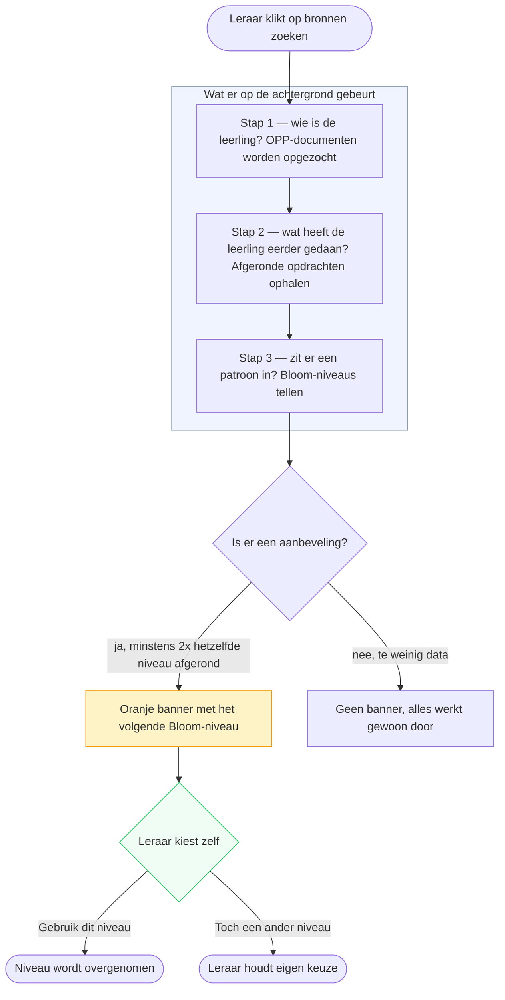
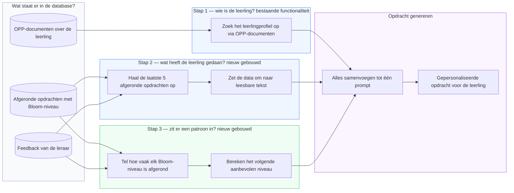

# RAS Implementatieplan

## Overzicht

Dit document beschrijft hoe de **RAS pipeline** (Retrieval-Augmented System) als aanvulling op de bestaande Agentic RAG aanpak is geïntegreerd in de Juf Aimee codebase, inclusief de **portfolio-analyse** voor patroonherkenning uit de leerlinggeschiedenis.

RAS **vervangt Agentic RAG niet** — het bouwt er bovenop. De OPP vector search (het hart van Agentic RAG) blijft de basis. RAS voegt daar een tweede retrieval kanaal aan toe: de **leerlinggeschiedenis** — een opeenstapeling van afgeronde opdrachten en leerkrachtfeedback over tijd.

De leerlinggeschiedenis is de kern van de meerwaarde van RAS. Het zijn de dynamische patronen die het verschil maken:
- Waar liep de leerling steeds tegenaan?
- Wat vond de leerkracht herhaaldelijk belangrijk?
- Op welk Bloom-niveau heeft de leerling al meerdere opdrachten afgerond?

Die patronen maken het mogelijk om niet alleen een relevante opdracht te genereren, maar een opdracht die **aansluit op de ontwikkeling van de leerling over tijd**.

```
Agentic RAG:  OPP vector search → genereer opdracht (statisch profiel)
RAS:          OPP vector search
            + leerlinggeschiedenis (afgeronde opdrachten + leerkrachtfeedback)
            + portfolio-analyse (patroonherkenning uit leerlinggeschiedenis)
            → genereer opdracht (dynamisch, aansluitend op ontwikkeling)
```

---

## Architectuur: wat is gebouwd

De implementatie bestaat uit drie lagen die op elkaar bouwen:





### Laag 1 — RAG (bestaand)
OPP vector search: haalt statische profielinformatie op over de leerling via pgvector.

### Laag 2 — RAS: `lib/ras/retrieveLeerlinggeschiedenis.ts`
Haalt de dynamische leerlinggeschiedenis op: de laatste N afgeronde opdrachten inclusief leerkrachtfeedback en ingediende bestanden.

### Laag 3 — Portfolio-analyse: `lib/portfolio-analysis.ts`
Deterministisch patroonherkenning bovenop de leerlinggeschiedenis. Geen LLM — puur op basis van data. Detecteert Bloom-patronen en suggereert het volgende niveau.

---

## Gerealiseerde bestanden

| Bestand | Rol |
|---|---|
| `lib/ras/retrieveLeerlinggeschiedenis.ts` | Haalt afgeronde opdrachten op met feedback uit de database |
| `lib/portfolio-analysis.ts` | Analyseert Bloom-patronen deterministisch, genereert `suggestedNextBloom` |
| `app/api/assign/route.ts` | Integreert RAG + RAS + portfolio-analyse in de AI pipeline |
| `app/student/[id]/generate/AiAssignmentClient.tsx` | Toont de aanbevelingsbanner aan de leraar in de UI |

---

## Stap 1 — `lib/ras/retrieveLeerlinggeschiedenis.ts`

Haalt de laatste 5 afgeronde opdrachten op per leerling, inclusief leerkrachtfeedback en ingediende bestanden.

```ts
export async function retrieveLeerlinggeschiedenis(
  studentId: string,
  take = 5
): Promise<LeerlinggeschiedenisItem[]> {
  return prisma.assignment.findMany({
    where: { studentId, status: "COMPLETED" },
    select: {
      title: true,
      bloomLevel: true,
      studentWork: true,
      teacherFeedback: { select: { content: true } },
      submissions: { select: { fileName: true } },
    },
    orderBy: { updatedAt: "desc" },
    take,
  });
}
```

De functie `formatLeerlinggeschiedenis()` zet de opgehaalde data om naar een leesbare tekst die als context meegegeven wordt aan het LLM.

**Wat het teruggeeft per opdracht:**
- `title`, `bloomLevel` — wat voor opdracht het was en op welk niveau
- `studentWork` — het ingeleverde werk van de leerling
- `teacherFeedback.content` — geschreven feedback van de leerkracht
- `submissions` — ingediende bestanden (bijv. tekeningen)

---

## Stap 2 — `lib/portfolio-analysis.ts`

Analyseert de leerlinggeschiedenis **deterministisch** — zonder LLM. Detecteert patronen in Bloom-niveaus en leerkrachtfeedback.

### Bloom-patroonherkenning

```ts
const BLOOM_ORDER = [
  "Onthouden", "Begrijpen", "Toepassen",
  "Analyseren", "Evalueren", "Creëren",
];

// suggestedNextBloom: het niveau ná het hoogste niveau dat ≥2x is afgerond
for (let i = BLOOM_ORDER.length - 1; i >= 0; i--) {
  const level = BLOOM_ORDER[i];
  if ((bloomFrequency[level] ?? 0) >= 2) {
    suggestedNextBloom = BLOOM_ORDER[i + 1] ?? null;
    break;
  }
}
```

**Logica:** Als een leerling een Bloom-niveau minimaal 2x heeft afgerond, is er voldoende bewijs dat dit niveau beheerst wordt. Het systeem suggereert dan het volgende niveau.

### Feedback-analyse

De functie detecteert ook moeite- en succesgebieden op basis van trefwoorden in leerkrachtfeedback:

```ts
const NEGATIVE_KEYWORDS = ["te makkelijk", "moeite", "moeilijk", "meer uitdaging", "niet goed"];
const POSITIVE_KEYWORDS = ["goed gedaan", "uitstekend", "sterk", "prima", "goed gelukt"];
```

### Output: `PortfolioInsights`

```ts
type PortfolioInsights = {
  completedCount: number;           // aantal afgeronde opdrachten
  bloomFrequency: Record<string, number>; // hoe vaak elk niveau is afgerond
  suggestedNextBloom: string | null; // aanbevolen volgend Bloom-niveau
  strugglingAreas: string[];        // opdrachten met negatieve feedback
  successAreas: string[];           // opdrachten met positieve feedback
  portfolioSummary: string;         // leesbare samenvatting voor in de prompt
};
```

---

## Stap 3 — Integratie in `app/api/assign/route.ts`

De drie lagen worden gecombineerd in de API route:

```ts
// Laag 1: RAG — statisch leerlingprofiel
const sources = await zoekVolledigProfiel(student.id, focusArea);

// Laag 2: RAS — dynamische leerlinggeschiedenis
const geschiedenisItems = await retrieveLeerlinggeschiedenis(student.id);
const geschiedenis = formatLeerlinggeschiedenis(geschiedenisItems);

// Laag 3: Portfolio-analyse — patroonherkenning
const portfolioInsights = analyzePortfolio(student.assignments);
```

Bij de `search` actie wordt `suggestedNextBloom` direct teruggegeven aan de frontend:

```ts
if (action === "search") {
  return NextResponse.json({
    sources,
    suggestedNextBloom: portfolioInsights.suggestedNextBloom,
  });
}
```

De `LEERLINGGESCHIEDENIS` en `PORTFOLIO ANALYSE` secties worden als context meegegeven in de prompt aan het LLM.

---

## Stap 4 — UI: aanbevelingsbanner in `AiAssignmentClient.tsx`

Na het klikken op "Bronnen zoeken" verschijnt een oranje banner als het systeem een aanbeveling heeft:

```tsx
{suggestedNextBloom && suggestedNextBloom !== selectedBloom && (
  <div className="flex items-center justify-between rounded-xl border border-amber-200 bg-amber-50 px-4 py-3">
    <p className="text-sm text-amber-800">
      <span className="font-semibold">Aanbeveling:</span> Op basis van eerdere opdrachten
      is <span className="font-semibold">{suggestedNextBloom}</span> het volgende
      passende niveau voor {student.name}.
    </p>
    <button onClick={() => setSelectedBloom(suggestedNextBloom)}>
      Gebruik dit niveau
    </button>
  </div>
)}
```

**Ontwerpkeuze — leraar behoudt de eindbeslissing:** De banner is een suggestie, geen automatische overschrijving. De leraar klikt zelf op "Gebruik dit niveau" of negeert de aanbeveling. Dit is in lijn met het kernprincipe van Juf Aimee: *AI ondersteunt de leraar, vervangt deze niet.*

---

## Gedrag zonder portfolio (graceful degradation)

RAS is een aanvulling op Agentic RAG, geen vervanging:

| Situatie | Gedrag |
|---|---|
| Leerling heeft geen afgeronde opdrachten | Alleen OPP-bronnen gebruikt — identiek aan huidig RAG gedrag |
| Leerling heeft opdrachten maar één per niveau | `suggestedNextBloom` is null, geen banner getoond |
| Leerling heeft ≥2 opdrachten op hetzelfde niveau | `suggestedNextBloom` wijst naar het volgende niveau, banner verschijnt |
| Leerling heeft Creëren ≥2x afgerond | Geen volgend niveau mogelijk, `suggestedNextBloom` is null |

Het systeem verbetert **progressief** naarmate de leerlinggeschiedenis groeit, zonder dat bestaande functionaliteit breekt.

---

## Ethiek en ontwerpverantwoording

### Stakeholder: de leraar staat centraal

De primaire stakeholder van deze oplossing is de **leraar**. Tijdens het ontwerp is bewust gekozen om de aanbeveling als *suggestie* te tonen in plaats van automatisch het Bloom-niveau over te schrijven.

**Ontwerpkeuze:** De leraar klikt zelf op "Gebruik dit niveau" of negeert de aanbeveling volledig.

**Onderbouwing:** Een leraar kent de leerling persoonlijk — context die het systeem niet heeft. Factoren zoals motivatie, thuissituatie of een moeilijke week zijn niet zichtbaar in de data. De AI ondersteunt de leraar, maar de **eindbeslissing blijft altijd bij de leraar**. Dit is in lijn met het kernprincipe van Juf Aimee.

---

### Privacy (AVG)

Leerlingdata die verwerkt wordt door RAS en portfolio-analyse:
- Titels en Bloom-niveaus van afgeronde opdrachten
- Leerkrachtfeedback
- Ingeleverd werk van de leerling

**Maatregelen:**
| Risico | Maatregel |
|---|---|
| Leerlingdata naar externe partijen | Alle verwerking lokaal via Ollama — geen data verlaat het systeem |
| Opslag van gevoelige feedback | Data blijft in de eigen database (Prisma/PostgreSQL) |
| Onbevoegde toegang | Alleen de ingelogde leraar heeft toegang tot de leerlingdata |

De lokale verwerking via Ollama is een bewuste architectuurkeuze met privacy als motivatie, conform de **AVG** (Algemene Verordening Gegevensbescherming).

---

### Ethische implicaties

**1. Algoritmische aanbeveling kan verkeerd zijn**
Het systeem baseert `suggestedNextBloom` op frequentie (≥2x afgerond). Dit is een simplificatie — een leerling kan een niveau meerdere keren hebben afgerond zonder het echt te beheersen.

*Maatregel:* De aanbeveling is zichtbaar als suggestie met een toelichting ("Op basis van eerdere opdrachten"). De leraar beoordeelt zelf of de aanbeveling klopt.

**2. Bias door beperkte data**
Als een leerling weinig afgeronde opdrachten heeft, is de analyse minder betrouwbaar. Een leerling die net begint krijgt geen aanbeveling (`suggestedNextBloom` is null).

*Maatregel:* Het systeem toont de banner alleen als er voldoende bewijs is (minimaal 2 afgeronde opdrachten op hetzelfde niveau). Bij onvoldoende data wordt geen aanbeveling gedaan.

**3. Leraar afhankelijkheid van AI**
Er is een risico dat leraren klakkeloos de aanbeveling volgen zonder kritisch na te denken.

*Maatregel:* De banner is bewust terughoudend in toon ("Op basis van eerdere opdrachten is X **het volgende passende niveau**") en vereist een actieve klik van de leraar.

---

### Leerlinggeschiedenis

Het systeem werkt voor alle leerlingen, ongeacht hoeveel geschiedenis beschikbaar is:
- **Geen geschiedenis** → geen banner, normale werking
- **Weinig geschiedenis** → geen banner, normale werking
- **Voldoende geschiedenis** → banner met aanbeveling

Er wordt geen onderscheid gemaakt op basis van kenmerken van de leerling. De aanbeveling is puur gebaseerd op aantoonbaar gedrag (afgeronde opdrachten).

---
