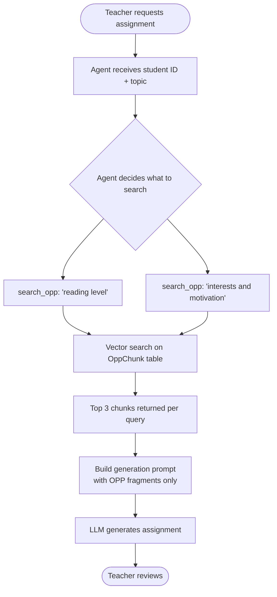
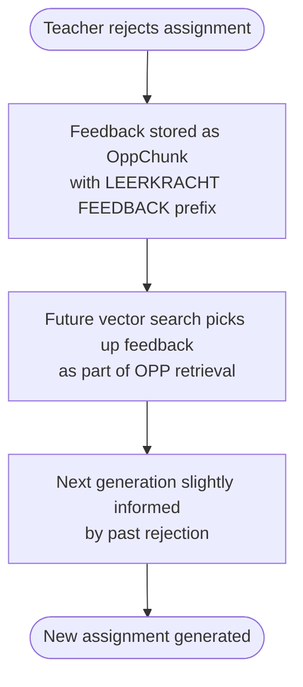
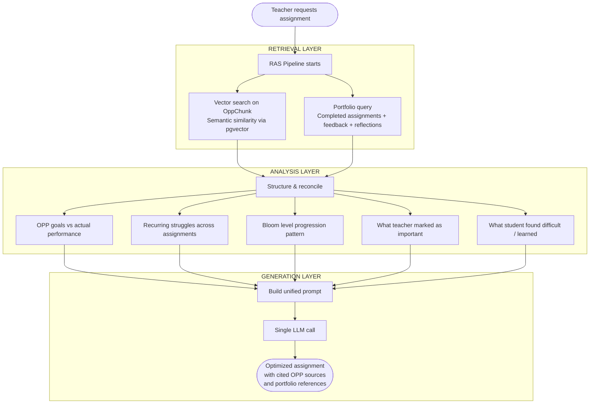
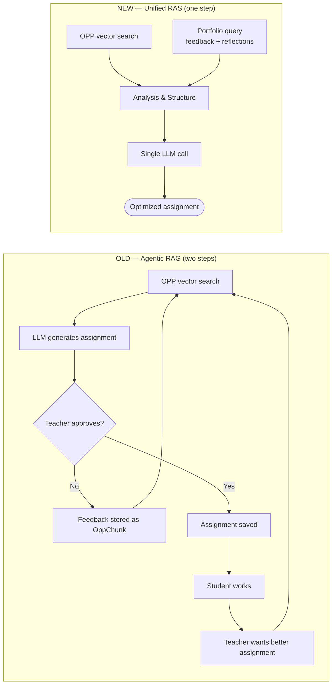
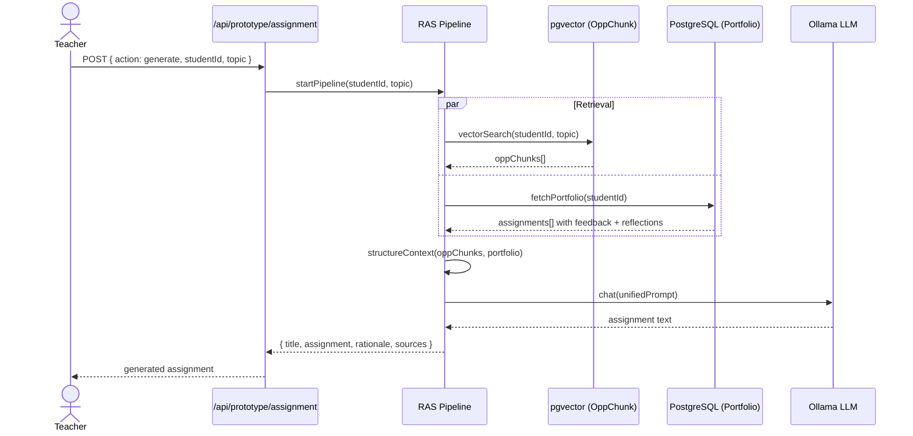

# From RAG to RAS — Unified Assignment Generation Pipeline

## Table of Contents

- [From RAG to RAS — Unified Assignment Generation Pipeline](#from-rag-to-ras--unified-assignment-generation-pipeline)
  - [Table of Contents](#table-of-contents)
  - [1. Background](#1-background)
  - [2. How It Used to Work — Agentic RAG](#2-how-it-used-to-work--agentic-rag)
    - [Step 1 — Generate from OPP (RAG)](#step-1--generate-from-opp-rag)
    - [Step 2 — Optimize based on rejection (partial RAS)](#step-2--optimize-based-on-rejection-partial-ras)
  - [3. The Problem with Two Steps](#3-the-problem-with-two-steps)
  - [4. The New Approach — Unified RAS](#4-the-new-approach--unified-ras)
  - [5. What RAS Retrieves](#5-what-ras-retrieves)
    - [Channel 1 — OPP Chunks (Vector Search)](#channel-1--opp-chunks-vector-search)
    - [Channel 2 — Portfolio (Structured Query)](#channel-2--portfolio-structured-query)
  - [6. Full Pipeline Comparison](#6-full-pipeline-comparison)
  - [7. Technical Architecture](#7-technical-architecture)
    - [Data flow](#data-flow)
    - [Folder structure (relevant files)](#folder-structure-relevant-files)
  - [8. The Unified Prompt Structure](#8-the-unified-prompt-structure)
  - [9. Data Model Changes](#9-data-model-changes)
  - [10. Sources](#10-sources)

---

## 1. Background

The application generates personalized assignments for students based on their **OPP** (Ontwikkelingsperspectief — Development Perspective) document. The initial implementation used **Agentic RAG** to retrieve relevant OPP fragments and pass them to an LLM for generation.

As the system matures, a richer source of student data becomes available: the **portfolio** — a growing record of completed assignments, teacher feedback, and student reflections. The **RAS pipeline** (Retrieval, Analysis, Structure) replaces and extends the RAG approach by incorporating all of this data into a single, unified generation step.

---

## 2. How It Used to Work — Agentic RAG

The original pipeline operated in two conceptually separate steps:

### Step 1 — Generate from OPP (RAG)



### Step 2 — Optimize based on rejection (partial RAS)



**What was missing:**

- No structured teacher feedback on completed student work
- No student reflection on assignments
- Portfolio history not part of the generation context
- Feedback stored as raw text in OPP chunks — imprecise and lossy
- Required two full LLM calls to produce an optimized result

---

## 3. The Problem with Two Steps

| Issue | Impact |
|---|---|
| Two separate LLM calls | Slower, more resource-intensive |
| First generation ignores real performance | Assignment not grounded in what actually happened |
| Optimization blind to OPP | Optimized assignment may drift from learning goals |
| Rejection feedback stored as OPP chunk | Unstructured, hard to query precisely |
| No student reflection | Reflection not part of the input |
| Portfolio grows but is never used | Valuable longitudinal data is wasted |

---

## 4. The New Approach — Unified RAS

**RAS** stands for **Retrieval, Analysis, Structure**. It is not a separate step after RAG — it *replaces and subsumes* RAG entirely. The "Retrieval" layer of RAS handles all sources of data, including the vector search on OPP chunks that RAG was doing.

> **RAG** = retrieve from documents → generate
>
> **RAS** = retrieve from documents + structured data → analyse → structure → generate (one step)



---

## 5. What RAS Retrieves

RAS operates on two retrieval channels simultaneously:

### Channel 1 — OPP Chunks (Vector Search)

> Previously owned by RAG. Now a retrieval source within RAS.

- **Source:** `OppChunk` table in PostgreSQL with `pgvector` extension
- **Method:** Cosine distance search using `<=>` operator
- **Embedding model:** `jeffh/intfloat-multilingual-e5-large:f16` (1024 dimensions)
- **Returns:** Top 3–5 semantically relevant OPP fragments with similarity scores
- **Informs:** What the student *should* be working toward (learning goals, needs, profile)


### Channel 2 — Portfolio (Structured Query)

> New. Retrieves longitudinal student performance data.

- **Source:** `Assignment` + `TeacherFeedback` + `Reflection` tables
- **Method:** Direct Prisma query, no vector search needed
- **Returns:** Last N completed assignments with all associated data
- **Informs:** What the student *actually* did, how the teacher responded, how the student reflected


---

## 6. Full Pipeline Comparison



| Dimension | Agentic RAG | Unified RAS |
|---|---|---|
| LLM calls per assignment | 2+ | 1 |
| Uses OPP documents | Yes | Yes |
| Uses past assignments | No | Yes |
| Uses teacher feedback | Partial (rejection only) | Full (structured) |
| Uses student reflection | No | Yes |
| Portfolio-aware | No | Yes |
| Feedback precision | Low (stored as OPP chunk) | High (dedicated model) |
| Assignment improvement over time | Slow | Progressive |

---

## 7. Technical Architecture

### Data flow



### Folder structure (relevant files)

```
lib/
├── ras/
│   ├── pipeline.ts          ← orchestrates retrieval + analysis + generation
│   ├── retrieveOpp.ts       ← vector search on OppChunk (moved from lib/tools/searchDocs.ts)
│   ├── retrievePortfolio.ts ← structured query for completed assignments + feedback + reflections
│   └── structureContext.ts  ← combines both sources, extracts patterns, builds context object
├── db.ts                    ← Prisma client (unchanged)
└── ollama.ts                ← Ollama client (unchanged)

app/api/prototype/assignment/
└── route.ts                 ← generate action now calls lib/ras/pipeline.ts
```

---

## 8. The Unified Prompt Structure

The single LLM call receives a structured prompt built from all retrieved data:

```
SYSTEM
──────
You are Juf Aimee, a pedagogical AI assistant for primary school teachers.
Generate one personalized assignment for the student below.
Always cite OPP sources. Always reference what the student previously reflected on.
Never repeat assignment types the teacher has rejected.

USER
────
[Student Profile]
Name: ...
Group: ...
Bloom level: 3 (Toepassen)
Learning style: visual, prefers working alone
Strengths: creative, motivated by stories

[OPP Context — from vector search]
Source 1 (score: 0.91): "... heeft moeite met het structureren van langere teksten ..."
Source 2 (score: 0.87): "... toont interesse in creatief schrijven en vertellen ..."
Source 3 (score: 0.82): "... leerdoel: alinea's herkennen en zelf toepassen ..."

[Portfolio Context — last 3 completed assignments]
Assignment: "Maak een verhaal met 3 alinea's"
  Student work: "Het was een keer... (submitted 3 paragraphs)"
  Teacher feedback: "Good structure, but transitions between paragraphs are weak"
  Student reflection: "I found it hard to connect the paragraphs. I want to practice that."

Assignment: "Beschrijf je favoriete dag"
  Student work: "Mijn favoriete dag is..."
  Teacher feedback: "Good vocabulary, needs more detail in the middle section"
  Student reflection: "I didn't know what to write in the middle. Maybe I need an example."

[Analysis]
- Recurring struggle: paragraph structure and transitions
- OPP goal not yet met: applying paragraph structure independently
- Student is ready for Bloom level 3 (applying, not just remembering)
- Teacher values: detail, cohesion
- Student learns best with: examples and stories as scaffolding

[Instruction]
Generate one assignment that:
1. Targets the recurring struggle (paragraph transitions)
2. Is grounded in OPP source 1 and 3 (cite them in the rationale)
3. References the student's own reflection ("I need an example")
4. Matches Bloom level 3 (Toepassen)
5. Output format: TITLE / ASSIGNMENT / RATIONALE / SOURCES
```

---

## 9. Data Model Changes

The following additions to `prisma/schema.prisma` are required to support the portfolio channel:

```prisma
model Assignment {
  // existing fields ...

  teacherFeedback  TeacherFeedback?  // NEW
  reflection       Reflection?        // NEW
}

model TeacherFeedback {
  id            String     @id @default(uuid())
  assignmentId  String     @unique
  assignment    Assignment @relation(fields: [assignmentId], references: [id], onDelete: Cascade)
  content       String     // teacher's written feedback
  createdAt     DateTime   @default(now())
}

model Reflection {
  id            String     @id @default(uuid())
  assignmentId  String     @unique
  assignment    Assignment @relation(fields: [assignmentId], references: [id], onDelete: Cascade)
  content       String     // student's written reflection
  createdAt     DateTime   @default(now())
}
```

> **Note:** The portfolio itself requires no new model. It is derived by querying `Assignment` records with status `COMPLETED`, including their `teacherFeedback` and `reflection` relations.

---

## 10. Sources

- Likun Lin (2025). Reading notes: A survey on retrieval and structuring augmented generation with large language models. Medium. https://medium.com/@ll3713/reading-notes-a-survey-on-retrieval-and-structuring-augmented-generation-with-large-language-735e9b2b12f0
- Pengcheng J, Siru O, Yizhu J, Ming Z, Runchu T, Jiawei H. (2025). A survey on retrieval and structuring augmented generation with large language models. arXiv. https://arxiv.org/abs/2509.10697


