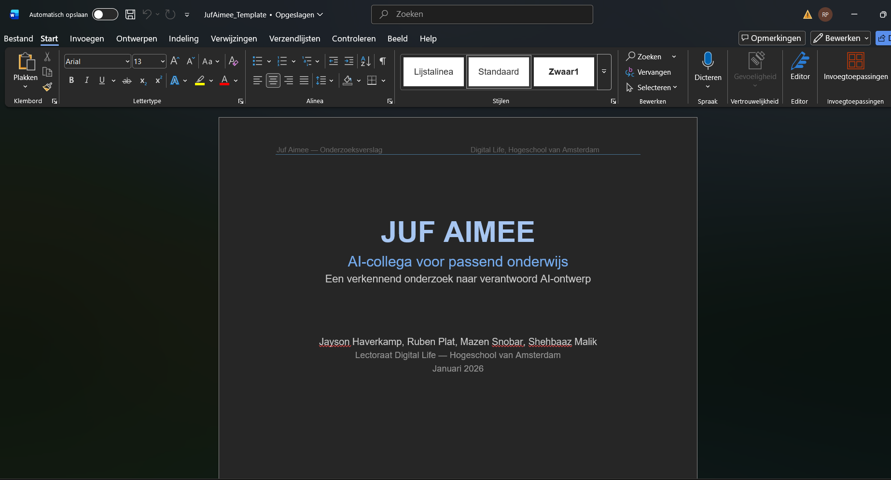

# Template Onderzoeksverslag

## Aanleiding

Binnen het team was er nog geen duidelijke structuur voor het onderzoeksverslag. Hierdoor was het:
- onduidelijk wat er nog gedaan moest worden  
- lastig om werk te verdelen  
- moeilijk om naar een consistente eindversie toe te werken  

Tijdens de retrospective is besproken dat:
> er aan het einde van sprint 3 **minimaal een goede eerste versie van het onderzoeksverslag moet worden opgeleverd**

Om dit mogelijk te maken, is een duidelijke template noodzakelijk. Zonder template ontbreekt een goed beginpunt en structuur.

---

## Totstandkoming van de template

De template is opgesteld op basis van:

- een voorbeeld dat is aangeleverd door David  
- het eerder samengestelde onderzoeksverslag dat we aan het begin van het project hebben gemaakt  

Deze twee bronnen zijn gecombineerd om:
- bestaande inhoud te behouden  
- structuur te verbeteren  
- en een werkbare standaard voor het team neer te zetten  

Hierdoor is de template niet vanaf nul opgebouwd, maar gebaseerd op al bestaande en relevante input.

---

## Wat is deze template?

De template is een **eerste opzet van het onderzoeksverslag**, waarin:

- de structuur volledig is uitgewerkt  
- een deel van de inhoud al is ingevuld  
- duidelijk zichtbaar is wat nog ontbreekt  

Dit maakt het document een combinatie van:
- een **leidraad (template)**  
- en een **werkdocument (eerste versie van het verslag)**  

---

## Waarom is deze template belangrijk?

Deze template is essentieel omdat het:

- een **duidelijk startpunt** biedt voor het team  
- inzicht geeft in **wat er nog gedaan moet worden**  
- helpt bij het **verdelen van taken**  
- zorgt voor **consistentie in het eindproduct**  

Daarnaast ondersteunt het direct de sprintdoelstelling:
> het opleveren van een eerste versie van het onderzoeksverslag aan het einde van sprint 3  

Zonder deze structuur zou dit doel moeilijk haalbaar zijn.

---

## Persoonlijke groei

Het maken van deze template draagt bij aan mijn persoonlijke ontwikkeling doordat ik:

- initiatief neem binnen het team  
- structuur aanbreng in een complex project  
- verantwoordelijkheid pak voor een belangrijk onderdeel van het eindresultaat  

Daarnaast leer ik:
- hoe je een onderzoeksverslag logisch opbouwt  
- hoe je werk opsplitst in concrete en uitvoerbare onderdelen  
- hoe je iets oplevert dat direct waarde heeft voor het team  

---

## Gebruik binnen het team

De template is bedoeld om actief gebruikt te worden door het hele team.

Dit betekent dat:
- teamleden onderdelen kunnen oppakken en invullen  
- duidelijk is welke secties nog openstaan  
- er gezamenlijk gewerkt wordt aan één consistent document  

De template vormt daarmee de basis voor verdere uitwerking richting het eindverslag.

---

## Bewijs

Onderstaande screenshot laat zien dat de template voor het onderzoeksverslag is uitgewerkt:

---

## Conclusie

De template is een noodzakelijke stap om:
- structuur aan te brengen in het onderzoeksverslag  
- het team effectief te laten samenwerken  
- en het sprintdoel (eerste versie verslag) te behalen  

Het is een bewust gekozen aanpak, gebaseerd op bestaande input en gericht op zowel teamresultaat als persoonlijke groei.
