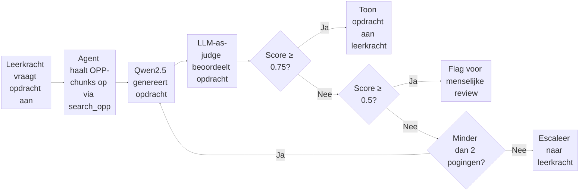

# LLM-as-Judge: Kwaliteitscontrole voor AI-gegenereerde opdrachten

## Evaluatiepipeline

---

## Wetenschappelijke Bronnen

- **LLM-as-judge**: Zheng et al. (2023) — https://arxiv.org/abs/2306.05685
- **G-Eval**: Liu et al. (2023) — https://arxiv.org/abs/2303.16634
- **RAGAS**: Es et al. (2023) — https://arxiv.org/abs/2309.15217
