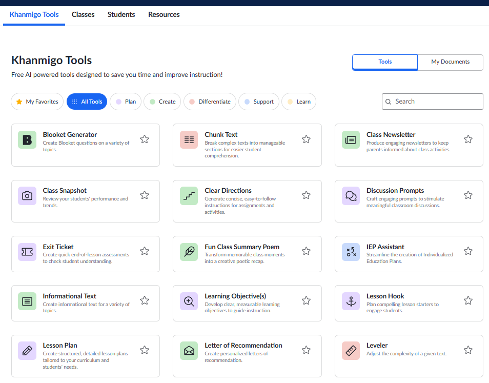
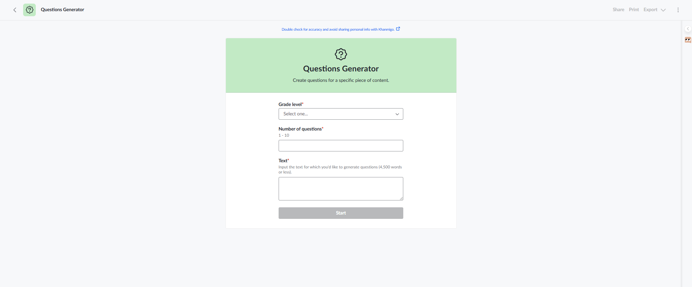
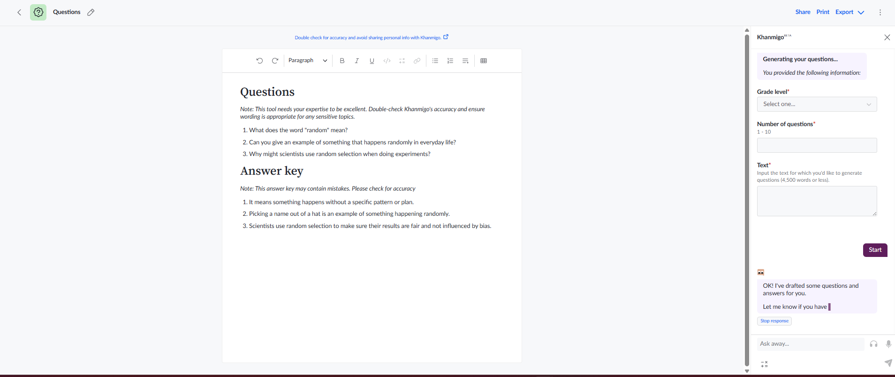
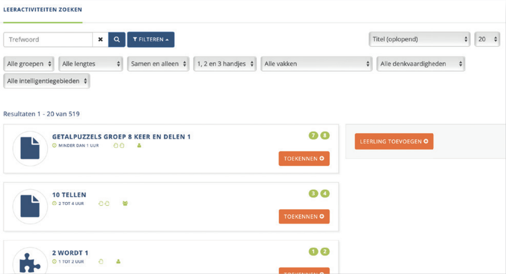

# Platform-analyse Hoogbegaafden 

**Juf Aimee — Studio Responsible AI | Sprint 2**

## Gebruikte frameworks

### Microsoft HAX Guidelines
Dit framework zijn een set van 18 op bewijs gebasseerde richtlijnen om een gebruiksgerichte en verantwoorde AI systemen te bouwen. Gekozen omdat dit framework specifiek gaat over hoe een gebruiker in controle blijft tijdens het gebruik van een AI-systeem. Het is wetenschappelijk onderbouwd en gevalideerd door Microsoft Research op basis van 20+ jaar onderzoek. 

### Google PAIR Guidebook
Dit framework is een verzameling richtlijnen van Google voor het ontwerpen van mensgerichte AI producten, gebaseerd op inzichten van honderden onderzoekers en industrie experts.
Gekozen omdat dit framework specifiek ingaat op hoe mensen en AI van elkaar kunnen leren over tijd. Dit sluit direct aan op de centrale vraag: hoe blijft de leraar de baas terwijl Juf Aimee zich aanpast?

---

## Bestaande oplossingen

### Khanmigo
Khanmigo is niet speciaal gericht op hoogbegaafde kinderen, maar is wel een AI-onderwijsassistent die de samenwerking tussen leraar en AI expliciet heeft vormgegeven, waardoor het een relevante casus is om te onderzoeken hoe Juf Aimee de leraar kan ondersteunen zonder diens regie over te nemen.

### Arcadin

Acadin is primair onderwijs voor hoogbegaafde en talentvolle leerlingen van groep 1-8. De leraren in dit platform hebben als doel leerlingen te prikkelen met uitdagende opdachten. Het platform heeft >650 leeractivteiten gebaseerd op het niveau, interesses en vaardigheden van de leerling. Het onderwijssysteem is zowel op school als online inzetbaar voor leerlingen.

---

## Analyse tabel
| Criterium | Khanmigo | MagicSchool AI |
|-----------|----------|----------------|
| **Microsoft HAX Guidelines — leraar in controle** | | |
| (G1) Maakt de AI duidelijk wat het wel en niet kan doen? | Ja — Khanmigo maakt dit op meerdere momenten duidelijk: bij de eerste popup bij de Question Generator: "You're the expert", in de sidebar "I use AI to help you teach and support your students", en bovenaan elke tool staat "Double check for accuracy". | |
| (G2) Maakt de AI duidelijk hoe goed het presteert? | Ja — Khanmigo is transparant over zijn beperkingen op meerdere plekken: "I'm still pretty new, so I sometimes make mistakes" in de sidebar, "This answer key may contain mistakes" bij de output, en "If you see Khanmigo make a mistake, tap the Thumbs Down icon" bij de eerste popup.| |
| (G7) Kan de leraar de AI makkelijk corrigeren? | Ja — Bij de tool: Question Generator: "If you see Khanmigo make a mistake, tap the Thumbs Down icon en de leraar kan via de ai assistant chat direct zeggen dat de vragen niet goed zijn en nieuwe laten genereren.
| |
| (G8) Legt de AI uit waarom het iets heeft gedaan? |Nee —  Bij het genereren van vragen vult de leraar zelf het grade level, hoeveelheid vragen en de tekst in als input. De AI baseert zich dus op wat de leraar aanlevert, maar legt niet uit waarom het deze specifieke vragen heeft gekozen. Er is geen referentie aan bijvoorbeeld de Taxonomie van Bloom.
   | |
| (G13) Gaat de AI netjes om met dingen die het niet weet? |Khanmigo Question Generator genereert toch vragen en antwoorden, ook bij onzintekst. Het geeft wel eerlijk aan in de antwoordsleutel dat de tekst geen betekenis heeft ("the text appears to be random letters"), maar weigert de taak niet. Het gaat dus door ook als de input zinloos is.
 | |
| (G16) Kan de leraar globaal instellen wat de AI doet? |In de accountinstellingen zijn er geen specifieke Khanmigo AI instellingen. De leraar kan wel algemene dingen instellen zoals taal, rol (leraar/coach) en of de klas mag meedoen aan onderzoek ("My classes may participate in research for product improvement"). Er is geen optie om het gedrag van de AI zelf globaal aan te passen.
 | |
| (G17) Wordt de leraar op de hoogte gesteld als de AI iets verandert? | | |
| **Google PAIR Guidebook — leren van elkaar** | | |
| Feedback + Controls — Hoe leert de AI van de leraar? |Ja — Bij de Question Generator zowel vooraf via de disclaimer "It'll learn to get better via the thumbs down button!" als achteraf via de "Leave feedback" knop.
 | |
| Feedback + Controls — Heeft de leraar controle over wat de AI onthoudt? |Nee — Khanmigo onthoudt niets tussen sessies. Na het sluiten van de tool begint de AI weer vanaf nul. De leraar moet elke keer opnieuw grade level, hoeveelheid vragen en input invullen. Getest door de tool te sluiten en opnieuw te openen, en door Khanmigo direct te vragen: "Do you remember our previous conversations?" waarop de AI zelf antwoordde: "I don't have access to previous conversations once our chat ends". | |
| Feedback + Controls — Geeft de AI expliciete uitleg over zijn keuzes? | Nee — Bij de Question Generators zegt de AI alleen "OK! I've drafted some questions and answers for you. Let me know if you have any questions!" zonder verdere toelichting.
| |
| Feedback + Controls — Kan de leraar meerdere AI-suggesties vergelijken en kiezen? | Gedeeltelijk — de leraar kan nieuwe versies opvragen via de chat, maar de oude en nieuwe versies staan niet automatisch naast elkaar. Je moet zelf scrollen om te vergelijken.| |
| Mental Models + Expectations — Hoe leert de leraar de AI beter begrijpen over tijd? |De AI chat interface leert de leraar dat je Khanmigo gewoon kunt aansturen via natuurlijke taal, dat is een laagdrempelige manier om de AI te begrijpen. | |

---

## Conclusie & Advies

### Wat doen de bestaande platformen goed

*Khanmigo*

Khanmigo herhaalt consistent *"You're the expert"* op meerdere momenten bij de eerste popup, in de sidebar en bij elke output. Dit is geen toevallige keuze maar een bewust ontwerpprincipe. Juf Aimee moet dit overnemen: de leraar is altijd de eindverantwoordelijke en dat moet voelbaar zijn door de hele tool heen.

Daarnaast werkt de AI chatinterface van Khanmigo goed, de leraar kan in eigen woorden bijsturen (*"These questions are not good enough, generate new ones"*) en de AI reageert direct. Dit is een laagdrempelige manier voor leraren om de AI aan te sturen.

*Arcadin*

Arcadin is een bestaande oplossing in het primair onderwijs en gebruikt diverse knopjes "leerling toevoegen" en "toekennen" waar de leraar gebruik van kan maken bij toewijzing van leeractiviteiten.
Het onderwijssysteem is in te zetten voor een kort leermoment en ook voor een lange leerlijn; daarover is nagedacht bij het maken van de opdrachten.

De leerling uploadt het werk documenten, foto's en filmpjes in een online portfolio met ook een reflectieformulier. Dit reflectieformulier helpt de leerling helpen begrijpen wat hij de volgende keer beter kan doen. En geeft ook de leraar inzichten bij het maken van nieuwe opdrachten. De begeleider ziet gelijk wat de leerling heeft gedaan en geeft ook feedback wat zichtbaar moet zijn voor de leerling.

## Resultaten

### Waar Juf Aimee het beter moet doen

Khanmigo is uiteindelijk een tool, de leraar moet altijd zelf een tool opstarten, input invullen en op start drukken. De AI doet nooit iets automatisch en onthoudt niets tussen sessies. Dit maakt Khanmigo meer een tool dan een echte collega.

Juf Aimee moet hier tussenin zitten:

- Proactief maar niet automatisch: Juf Aimee signaleert en suggereert, maar de leraar keurt altijd goed voordat een leerling iets ziet.
- Geheugen: Juf Aimee bouwt een leerlingprofiel op over tijd zodat opdrachten steeds beter aansluiten, in plaats van elke sessie opnieuw beginnen.
- Transparantie over waarom: Khanmigo legt niet uit waarom het bepaalde vragen genereert. Juf Aimee moet dit wel doen, bijvoorbeeld: *"Deze opdracht is gekozen omdat deze leerling toe is aan Analyseren (Bloom niveau 4)"*.

### Kernverschil samengevat

| | Khanmigo | Juf Aimee |
|---|---|---|
| Initiatief | Altijd de leraar | Beiden kunnen initiatief nemen |
| Geheugen | Geen. begint elke sessie opnieuw | Onthoudt leerlingprofiel over tijd |
| Uitleg | Geen referentie aan Bloom | Legt uit waarom op basis van Bloom |
| Rol leraar | Bedient de AI | Werkt samen met de AI |

