# Prototype na verwerken adviespunten

## Inleiding

Er is na het ontwerpen van het prototype een advies uitgebracht met relevante inzichten die waardevol zijn om te verwerken in het prototype voor het verbeteren van de functionaliteit en ook voor het gebruiksgemak van de gebruikers, waaronder de leraren en hoogbegaafde leerlingen. 
 In het ontwerp is er rekening gehouden met kleurgebruik, omdat er specifiek feedback is gegeven op het vorige ontwerp.

## Adviespunten verwerkt 

### inlogschermen

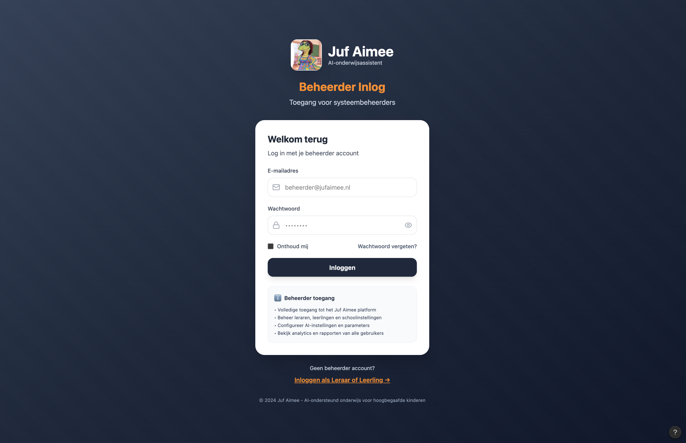
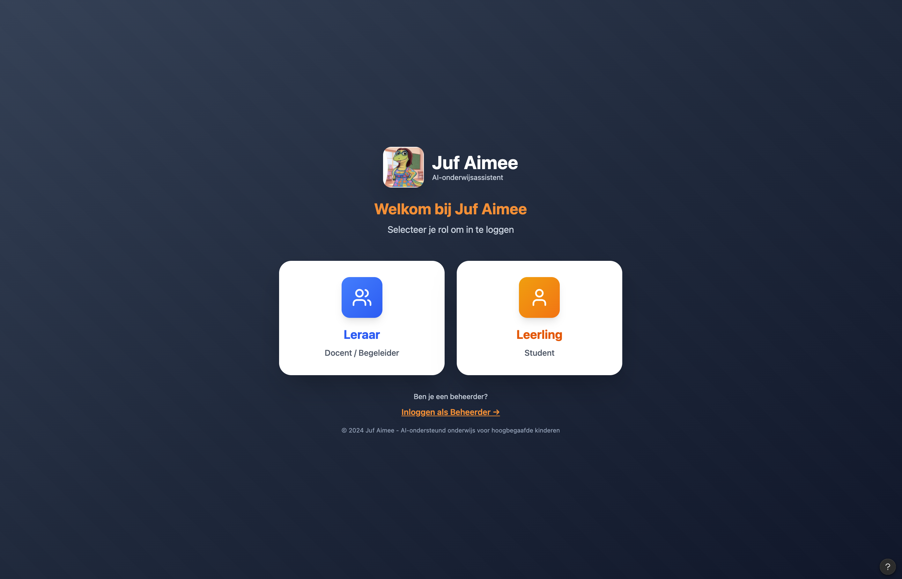
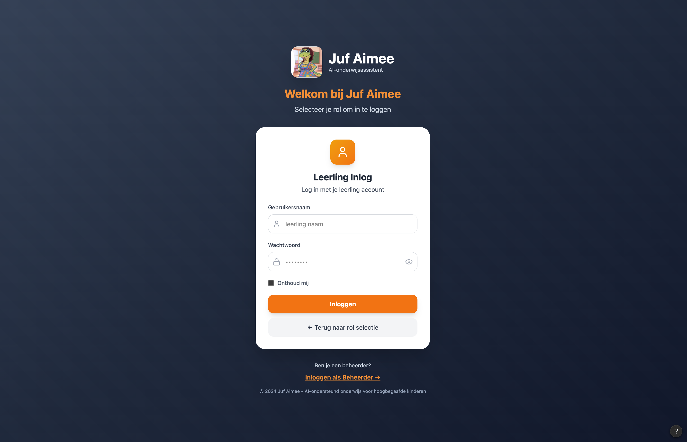

### Lerarenportaal

*De gegenereerde opdrachten met voortgang en zijn toegewezen door leraar*

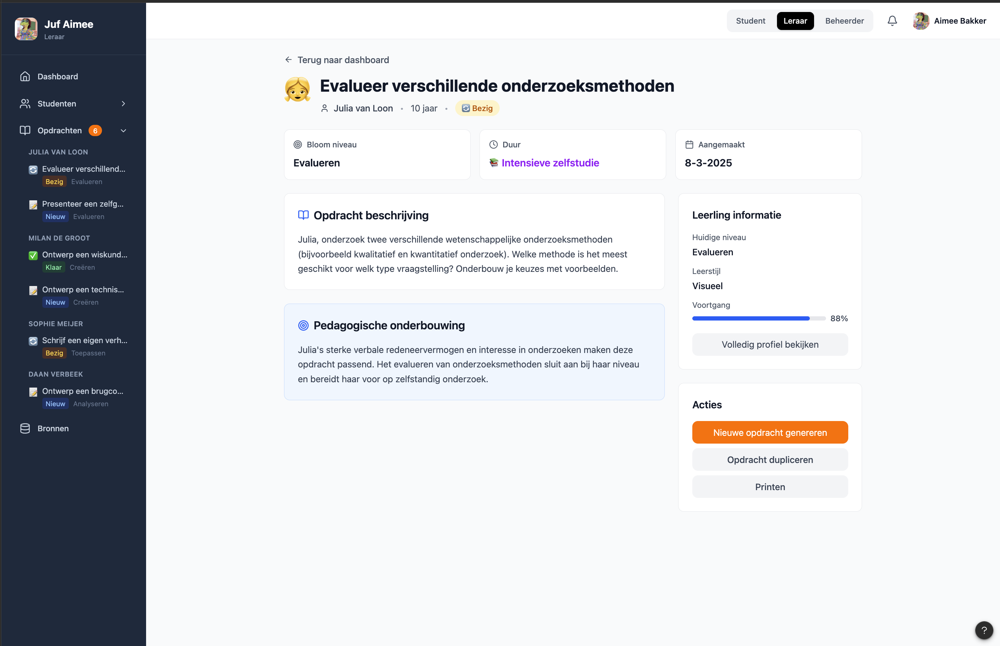

Feedback leraar voor afgeronde opdracht

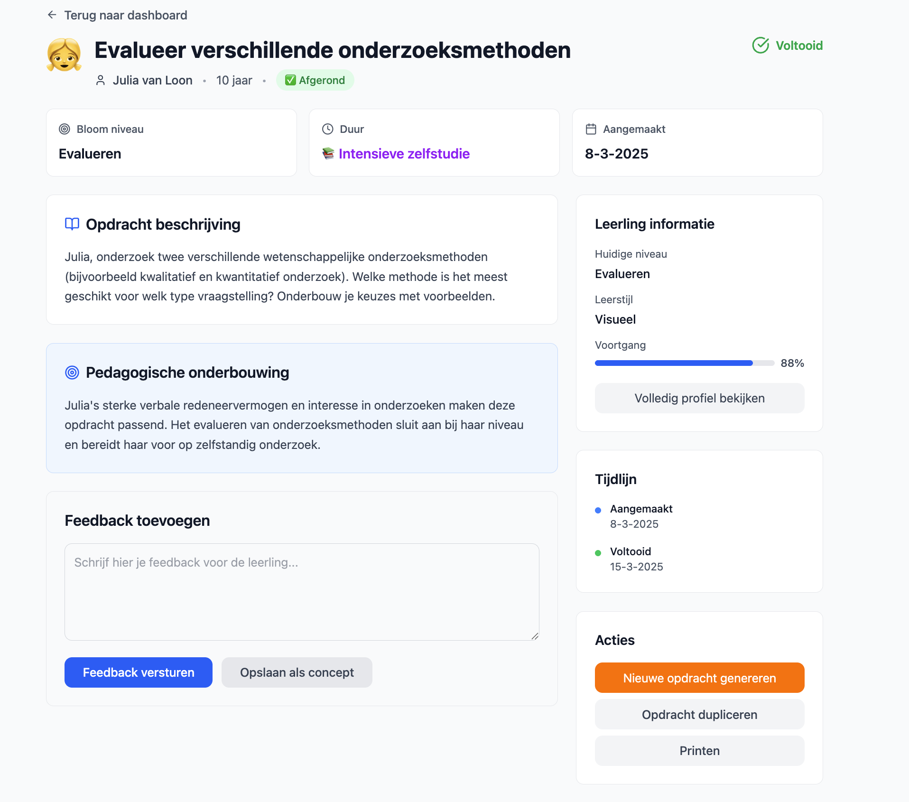

Nieuwe opdrachten genereren met behulp van portfolio en reflecties

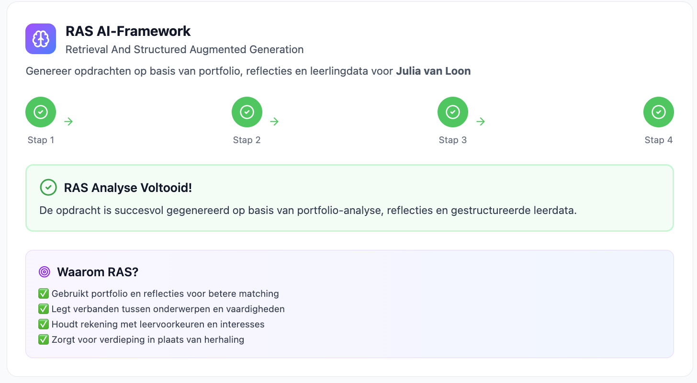

### Beheerdersportaal

leraren toevoegen aan Juf Aimee

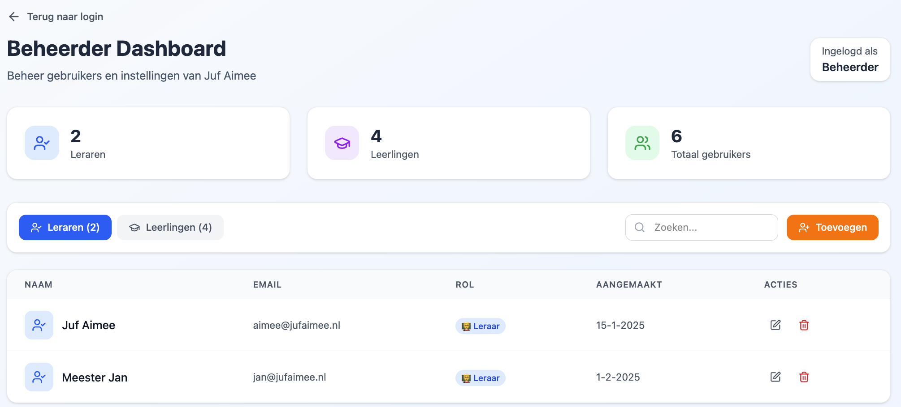

leerlingen toevoegen aan Juf Aimee

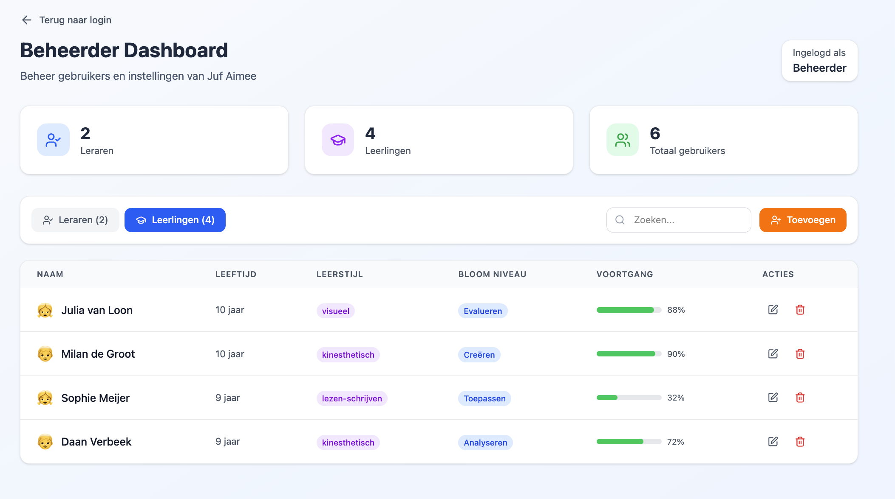

### Leerlingenportaal

Reflectieformulier leerling en feedback leraar voor de opdracht

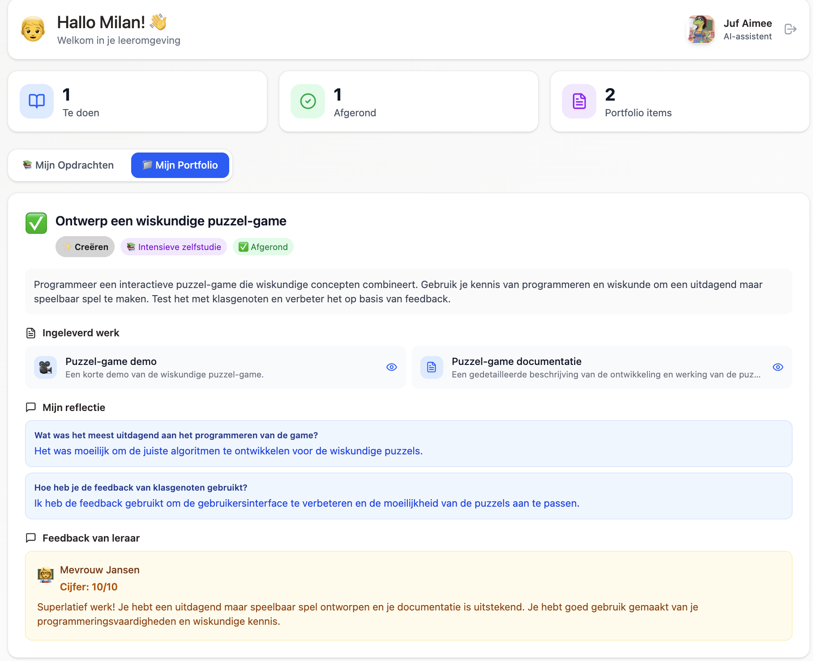

Uploaden resultaat van opdracht

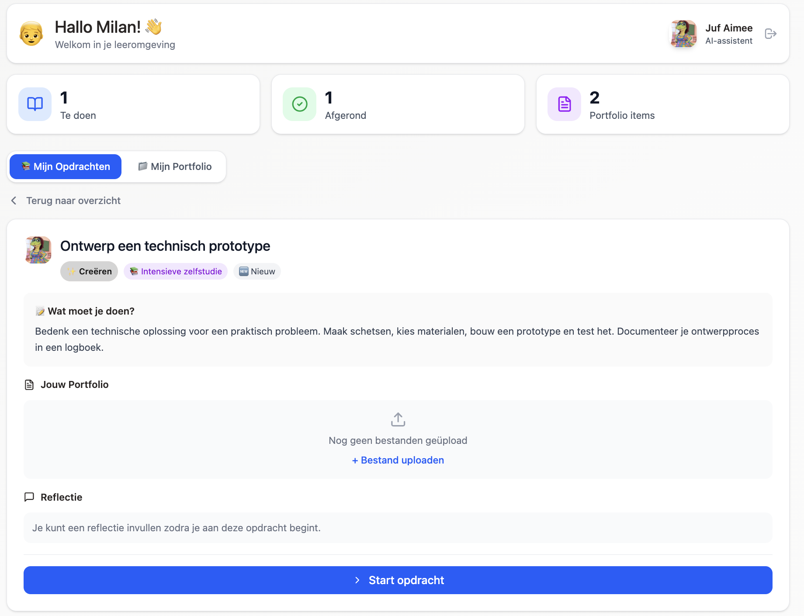

Startdatum en deadline

 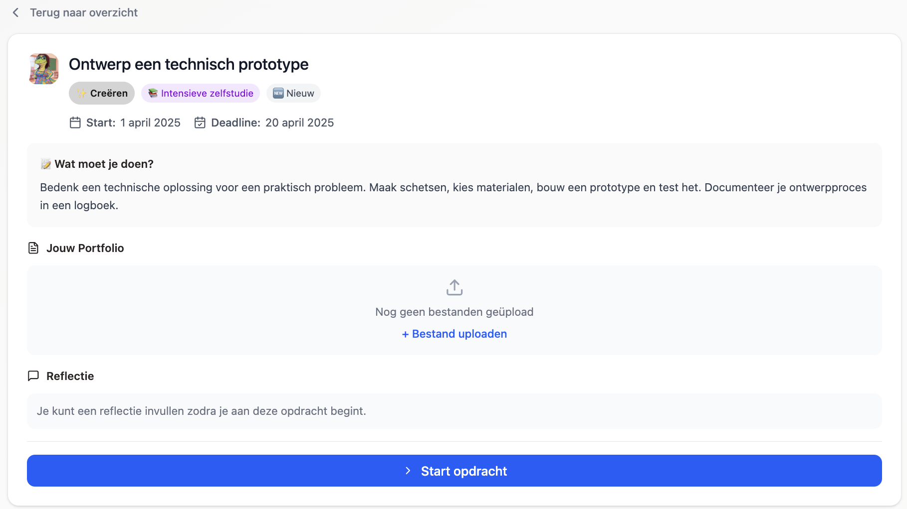