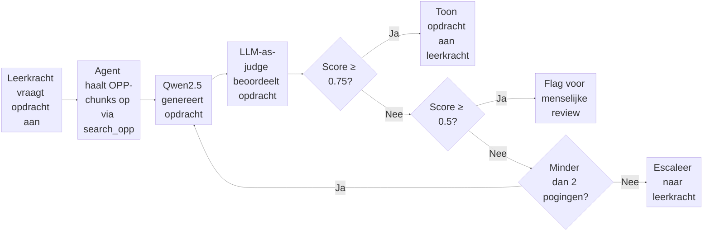

# LLM-as-Judge: Kwaliteitscontrole voor AI-gegenereerde opdrachten

Hoofdvraag:
Juf Aimee genereert een opdracht voor een leerling, maar hoe weet je of die opdracht goed genoeg is om aan het hoogbegaafde kind te geven? 


## Onzekerheden

### 1. Nu kan je niet verifiëren of de prompt altijd werkt
Een LLM is niet deterministisch - dezelfde prompt kan de ene keer een goede 
opdracht genereren en de andere keer een slechte. Zonder een judge heb je geen 
zekerheid over de kwaliteit van de output. Dit risico is extra groot omdat de 
doelgroep kinderen zijn (EU AI Act Art. 14).


## Voordelen en nadelen van een judge
### Voordelen

- Bespaart kosten en vermindert handmatig werk drastisch - Uit het onderzoek van Saha et al.(2026) beschrijven zij een praktisch scenario waarin een team 10.000 
prompt-response paren moet beoordelen. Menselijke beoordeling kost in dit 
scenario $5 per beoordeling, wat neerkomt op $50.000 in totaal. Een LLM judge 
doet hetzelfde voor $0.01 of minder per beoordeling.

- Explainability - Met LLM-as-a-judge kan de judge niet alleen een score 
geven, maar ook uitleggen waarom de gegenereerde opdracht goed of afgekeurd is. 
Dit helpt de leerkracht om de beoordeling te begrijpen en indien nodig zelf 
een beslissing te nemen.

### Nadelen

- De judge is niet altijd consistent - Een LLM is niet deterministisch. 
Dezelfde opdracht kan de ene keer een andere score krijgen dan de andere keer 
(Guo, 2025).

- De judge is zo goed als het OPP-profiel - Als de leerkracht het 
OPP-profiel niet regelmatig bijwerkt, kan de judge beoordelen op basis 
van verouderde informatie. De kwaliteit van de beoordeling is dus 
afhankelijk van hoe actueel de leerkracht het profiel houdt. De leerkracht 
is daarom verantwoordelijk voor het regelmatig updaten van het profiel 
wanneer zij veranderingen ziet in bijvoorbeeld de interesses of het 
niveau van het kind (EU AI Act Art. 14).

#### bronnen
- Saha et al. (2026). *LLM-as-a-Judge on a Budget*. arXiv:2602.15481. 
  Geraadpleegd via https://arxiv.org/html/2602.15481v1#S6

- Guo, S. (2025). *LLM-as-a-Judge: A Practical Guide*. Towards Data Science. 
  Geraadpleegd via https://towardsdatascience.com/llm-as-a-judge-a-practical-guide/

## Een evaluatierubric voor de judge 
Zonder evaluatierubric: de judge-AI krijgt een opdracht en zegt vaag "dit is goed" of "dit is slecht", maar niemand weet waarom, en je kunt het niet controleren of verbeteren.

Met rubric: de judge-AI scoort de opdracht op 5 meetbare criteria (1–5), geeft per criterium een onderbouwing, en de beslislogica bepaalt automatisch wat er gebeurt. Transparant, controleerbaar, en uitlegbaar aan een leerkracht.


```
Juf Aimee genereert opdracht → Judge scoort op rubric → Beslislogica zegt goedkeuren / flaggen / opnieuw genereren → Leerkracht ziet het resultaat
```

## Evaluatiepipeline



---
### Welke llms zijn hiervoor getraind? 
- JudgeLm
- Prometheus 2
#### Bronnen
bron Prometheus 2: https://arxiv.org/abs/2405.01535
### Judge prompt (Nog agmaken)
Example Prompt:
```
"You are an expert AI software architect auditing ..." 
```
### RAGAS 
Retrieval Augmented Generation Assesment

### Evaluatierubric opstellen

| # | Criterium | Type | Bron |
|---|---|---|---|
| 1 | Bevat de opdracht elementen die aansluiten op de interesses die in het leerlingprofiel staan? | Onderwijsspecifiek | Self-Determination Theory (Ryan & Deci, 2000) |
| 2 | Past de moeilijkheidsgraad van de opdracht bij het opgegeven Bloom-niveau van de leerling? | Onderwijsspecifiek | Bloom's Taxonomy (Anderson & Krathwohl, 2001) |
| 3 | Kan een leerling van deze leeftijd en dit niveau de opdracht zelfstandig uitvoeren? | Onderwijsspecifiek | Zone of Proximal Development (Vygotsky) |
| 4 | Sluit de opdracht aan bij de beginsituatie van de leerling, niet alleen bij het einddoel? | Onderwijsspecifiek | Roberts & Inman (2023) via Basisboek Hoogbegaafdheid H22 |
| 5 | Is de opdracht leeftijdspassend in taalgebruik, toon en inhoud voor dit kind? | Ethiek / Wetgeving | EU AI Act Art. 5 + AVG Art. 8 |
| 6 | Bevat de opdracht geen aannames of stereotypes op basis van geslacht, cultuur of achtergrond? | Ethiek / Wetgeving | EU AI Act Art. 10 + Gelijke Behandelingswet |
| 7 | Kan een leerkracht de opdracht makkelijk lezen, beoordelen en indien nodig aanpassen? | Ethiek / Wetgeving | EU AI Act Art. 14 |
| 8 | Zijn alle elementen in de opdracht terug te herleiden naar het leerlingprofiel, zonder verzonnen info? | RAGAS | Es et al., 2023 — faithfulness metric |
| 9 | Gebruikt de opdracht alleen relevante leerlinginfo en laat het irrelevante details weg? | RAGAS | Es et al., 2023 — context precision metric |
## Wetenschappelijke Bronnen

- **LLM-as-judge**: Zheng et al. (2023) — https://arxiv.org/abs/2306.05685
- **G-Eval**: Liu et al. (2023) — https://arxiv.org/abs/2303.16634
- **RAGAS**: Es et al. (2023) — https://arxiv.org/abs/2309.15217

- Basisboek (Hoog)begaafdheid voor po en vo: 

## bronnen
- https://towardsdatascience.com/llm-as-a-judge-a-practical-guide/