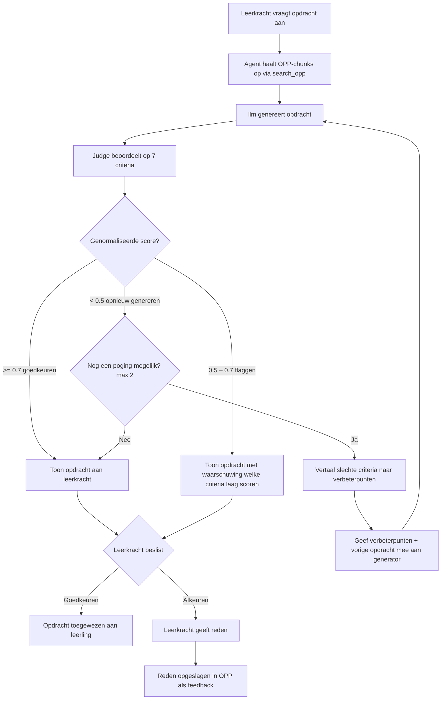

# LLM-as-Judge: Kwaliteitscontrole voor AI-gegenereerde opdrachten

Hoofdvraag:
Juf Aimee genereert een opdracht voor een leerling, maar hoe weet je of die opdracht goed genoeg is om aan het hoogbegaafde kind te geven? 


## Onzekerheden

### 1. Nu kan je niet verifiëren of de prompt altijd werkt
Een LLM is niet deterministisch - dezelfde prompt kan de ene keer een goede 
opdracht genereren en de andere keer een slechte. Zonder een judge heb je geen 
zekerheid over de kwaliteit van de output. Dit risico is extra groot omdat de 
doelgroep kinderen zijn (EU AI Act Art. 14).


## Voordelen en nadelen van een judge
### Voordelen

- Bespaart kosten en vermindert handmatig werk drastisch - Uit het onderzoek van Saha et al.(2026) beschrijven zij een praktisch scenario waarin een team 10.000 
prompt-response paren moet beoordelen. Menselijke beoordeling kost in dit 
scenario $5 per beoordeling, wat neerkomt op $50.000 in totaal. Een LLM judge 
doet hetzelfde voor $0.01 of minder per beoordeling.

- Explainability - Met LLM-as-a-judge kan de judge niet alleen een score 
geven, maar ook uitleggen waarom de gegenereerde opdracht goed of afgekeurd is. 
Dit helpt de leerkracht om de beoordeling te begrijpen en indien nodig zelf 
een beslissing te nemen.

### Nadelen

- De judge is niet altijd consistent - Een LLM is niet deterministisch. 
Dezelfde opdracht kan de ene keer een andere score krijgen dan de andere keer 
(Guo, 2025).

- De judge is zo goed als het OPP-profiel - Als de leerkracht het 
OPP-profiel niet regelmatig bijwerkt, kan de judge beoordelen op basis 
van verouderde informatie. De kwaliteit van de beoordeling is dus 
afhankelijk van hoe actueel de leerkracht het profiel houdt. De leerkracht 
is daarom verantwoordelijk voor het regelmatig updaten van het profiel 
wanneer zij veranderingen ziet in bijvoorbeeld de interesses of het 
niveau van het kind (EU AI Act Art. 14).

#### bronnen
- Saha et al. (2026). *LLM-as-a-Judge on a Budget*. arXiv:2602.15481. 
  Geraadpleegd via https://arxiv.org/html/2602.15481v1#S6

- Guo, S. (2025). *LLM-as-a-Judge: A Practical Guide*. Towards Data Science. 
  Geraadpleegd via https://towardsdatascience.com/llm-as-a-judge-a-practical-guide/

## Een evaluatierubric voor de judge 
Zonder evaluatierubric: de judge-AI krijgt een opdracht en zegt vaag "dit is goed" of "dit is slecht", maar niemand weet waarom, en je kunt het niet controleren of verbeteren.

Met rubric: de judge-AI scoort de opdracht op 7 meetbare criteria (1–5), geeft per criterium een onderbouwing, en de beslislogica bepaalt automatisch wat er gebeurt. Transparant, controleerbaar, en uitlegbaar aan een leerkracht.


```
Juf Aimee genereert opdracht → Judge scoort op rubric → Beslislogica zegt goedkeuren / flaggen / opnieuw genereren → Leerkracht ziet het resultaat
```
## Evaluatiepipeline



---
### Welke llms zijn hiervoor getraind? 
- JudgeLm
- Prometheus 2

#### Prometheus 2 
- Base model: Mistral-7B-Instruct-v0.2

Speciaal finegetuned om andere llms te beoordelen op basis van een rubric. 

Uit het onderzoek van Kim et al. (2024) - "Prometheus 2: An Open Source Language Model Specialized in Evaluating Other Language Models"


Onderzoek prompt template:

 

#### Bronnen
Kim, S., Suk, J., Longpre, S., Lin, B. Y., Shin, J., Welleck, S., Neubig, G., Lee, M., Lee, H., & Seo, M. (2024). *Prometheus 2: An open source language model specialized in evaluating other language models*. arXiv:2405.01535. https://arxiv.org/abs/2405.01535

### Judge prompt

Per criterium wordt de volgende promptstructuur gebruikt (Prometheus-2 Direct Assesment Prompt Template):

```
[INST] You are a fair judge assistant tasked with providing clear, objective feedback
based on specific criteria, ensuring each assessment reflects the absolute standards
set for performance.

###Task Description:
1. Write detailed feedback (2-4 sentences) based strictly on the score rubric.
2. After writing feedback, write a score between 1 and 5.
3. Output format: "Feedback: (feedback) [RESULT] (score)"
4. Do not generate any other opening, closing, or explanations.

###The instruction to evaluate:
Criterion: <criterium naam>

Structured student profile:
<profielSamenvatting — Engels, gedestilleerd uit OPP>

Supporting OPP excerpts (Dutch source document):
<ruwe OPP-tekst>

###Response to evaluate:
<gegenereerde opdracht>

###Reference Answer:
<referentieantwoord per criterium>

###Score Rubrics:
Score 1: ...  Score 5: ...

###Feedback: [/INST]
```

De `profielSamenvatting` is een gestructureerde Engelse samenvatting van het OPP (gebouwd door `buildProfileSummary` in `route.ts`), omdat Prometheus-2 een Engels-eerst model is en ruwe Nederlandse OPP-tekst moeilijker verwerkt. Per criterium worden **3 runs** gedraaid en gemiddeld, wat de score stabiliseert en uitbijters corrigeert.

## Implementatie

### Geïmplementeerde criteria

De judge (`lib/judge.ts`) scoort elke gegenereerde opdracht op 7 criteria, elk op een schaal van 1–5:

| # | Criterium | Bron |
|---|-----------|------|
| 1 | Zijn alle elementen traceerbaar naar het OPP, zonder verzonnen info? | RAGAS Faithfulness (Es et al., 2023) |
| 2 | Gebruikt de opdracht alleen relevante leerlinginfo? | RAGAS Context Precision (Es et al., 2023) |
| 3 | Weerspiegelt de opdracht alle relevante profielkenmerken, inclusief beperkingen? | RAGAS Context Recall (Es et al., 2023) |
| 4 | Bevat de opdracht elementen die aansluiten op de interesses uit het profiel? | Renzulli SEM (1977) + SDT (Ryan & Deci, 2000) |
| 5 | Past de cognitieve moeilijkheidsgraad bij het opgegeven Bloom-niveau? | Anderson & Krathwohl (2001) |
| 6 | Kan de leerling de opdracht zelfstandig uitvoeren? | Vygotsky ZPD (1978) + Reis & Renzulli (2010) |
| 7 | Is de opdracht leeftijdspassend in taal, toon en inhoud? | Piaget (1972) + Silverman (1997) |

Per criterium bouwt de judge een aparte prompt op in Prometheus-2 format en roept `ollama.generate()` aan (niet `ollama.chat()`, de Llama-2 chat template veroorzaakt bij Prometheus direct EOS).

### Beslislogica

De genormaliseerde score (totaal gedeeld door maximum) bepaalt de beslissing:

| Score | Beslissing | Betekenis |
|-------|-----------|-----------|
| ≥ 0.7 | `goedkeuren` | Opdracht wordt getoond aan leerkracht |
| 0.5 – 0.7 | `flaggen` | Opdracht wordt getoond met waarschuwing welke criteria laag scoren |
| < 0.5 | `opnieuw_genereren` | Systeem genereert automatisch een nieuwe poging |

### Feedbackloop bij opnieuw genereren

Als de score onder 0.5 valt, genereert het systeem automatisch een tweede poging, maar de generator krijgt dan gerichte feedback mee zodat hij weet wat er mis was.

**Hoe het werkt (`app/api/assign/route.ts`):**

1. De judge scoort de opdracht op alle 7 criteria
2. Criteria met een score ≤ 2 worden vertaald naar concrete Nederlandse verbeterpunten (`buildJudgeFeedback`)
3. De vorige (mislukte) opdracht wordt meegegeven als `currentAssignment`
4. De verbeterpunten worden als extra sectie in de generator-prompt gezet:

```
VERBETERPUNTEN UIT VORIGE VERSIE:
- De opdracht sluit niet aan op de gedocumenteerde interesses. Verwerk de interesses als kern van de opdracht, niet als decoratie.
- Het cognitieve niveau klopt niet met Bloom-niveau "Creëren". ontwerpen, construeren, samenstellen — de leerling MAAKT iets nieuws dat nog niet bestond.
```

De generator ziet dit als instructies van de leerkracht; er wordt niet vermeld dat een judge dit heeft bepaald. Criteria met score ≥ 3 worden niet genoemd; die waren goed genoeg.

**Maximum 2 pogingen.** Als na de tweede poging de score nog steeds onder 0.5 ligt, wordt de beste versie toch getoond aan de leerkracht.

---

## Volgende stappen 
Pairwise Ranking prompt zodat er twee opdrachten met elkaar vergeleken kunnen worden.
 
## Bronnen

- Zheng, L., Chiang, W., Sheng, Y., Zhuang, S., Wu, Z., Zhuang, Y., Lin, H., Li, Z., Li, D., Xing, E., Zhang, H., Gonzalez, J., & Stoica, I. (2023). *Judging LLM-as-a-judge with MT-bench and Chatbot Arena*. arXiv:2306.05685. https://arxiv.org/abs/2306.05685
- Liu, Y., Iter, D., Xu, Y., Wang, S., Xu, R., & Zhu, C. (2023). *G-Eval: NLG evaluation using GPT-4 with better human alignment*. arXiv:2303.16634. https://arxiv.org/abs/2303.16634
- Es, S., James, J., Espinosa-Anke, L., & Schockaert, S. (2023). *RAGAS: Automated evaluation of retrieval augmented generation*. arXiv:2309.15217. https://arxiv.org/abs/2309.15217
- Basisboek (Hoog)begaafdheid voor po en vo
- Guo, S. (2025). *LLM-as-a-judge: A practical guide*. Towards Data Science. https://towardsdatascience.com/llm-as-a-judge-a-practical-guide/


## Tests 

### Wat maakt een goede opdracht voor Noah Smit?

Op basis van zijn OPP (groep 6) zijn de belangrijkste factoren:

- Sluit aan op zijn interesse in **wetenschap en experimenten**
- Biedt **autonomie** en ruimte voor eigen keuzes
- Is **cognitief uitdagend**: open vragen, eigen redenering, iets nieuws produceren
- Heeft **duidelijke tussenstappen**: planning van grote taken vraagt nog sturing
- Vraagt **geen zwaar schrijfwerk** als doel op zich
- Bevat **geen herhaalwerk of routinetaken**: Noah haakt af en werkt slordig bij gebrek aan uitdaging
- Is **individueel uitvoerbaar**: samenwerken is nog een ontwikkelpunt voor Noah

```
Titel: Ontwerp je eigen weersysteem-experiment

Noah, jij wordt klimaatwetenschapper. Kies één klimaatzone op aarde (bijv.
woestijn, tropisch regenwoud of toendra) en doe onderzoek naar waarom het
daar zo regent — of juist niet.

Stap 1: Formuleer een hypothese
Bedenk een verklaring: waarom valt er in jouw gekozen klimaatzone zo veel of
zo weinig neerslag? Schrijf dit op als een echte wetenschappelijke hypothese
("Ik denk dat... omdat...").

Stap 2: Test je hypothese met data
Zoek klimaatdata op (temperatuur, neerslag, wind) van jouw zone. Vergelijk
minstens twee maanden met elkaar. Klopt jouw hypothese? Pas hem aan als dat
nodig is.

Stap 3: Ontwerp een experiment
Beschrijf een experiment dat je in de klas zou kunnen uitvoeren om één aspect
van jouw klimaatzone na te bootsen (bijv. verdamping, condensatie,
regenschaduw). Wat heb je nodig? Wat meet je? Wat verwacht je te zien?

Eindproduct: een onderzoeksverslag met hypothese, data-analyse en
experimentontwerp.
```
### Wat maakt een slechte opdracht voor Noah Smit?

- **Geen aansluiting heeft op zijn interesses**: niets met wetenschap of experimenten
- **Passief en gesloten is**: één correct antwoord, geen eigen redenering
- **Herhaalwerk of routinewerk vraagt**: Noah haakt af en werkt slordig
- **Geen autonomie biedt**: alles ligt vast, geen eigen keuzes
- **Niet terug te herleiden is naar zijn OPP**: elk kind had deze opdracht kunnen krijgen

```
Titel: Landen kleuren

Kleur de landen van Europa in op de kaart. Gebruik verschillende kleuren.
Schrijf bij elk land de hoofdstad op. Maak het mooi en netjes. Zorg dat je
binnen de lijnen kleurt.
```

### Testresultaten

Getest met `scripts/test-judge.ts`, model: `tensortemplar/prometheus2:7b-fp16`, `runs=3` per criterium.
Volledig rapport: [judge-testrapport-2026-05-02T10-38-48.txt](../Judge_tests/judge-testrapport-2026-05-02T10-38-48.txt)

Testresultaten (2026-05-02):

| Criterium | Goede opdracht | Slechte opdracht | Verschil |
|-----------|---------------|-----------------|---------|
| C1: Faithfulness | 3/5 | 1/5 | +2 |
| C2: Context Precision | 3/5 | 2/5 | +1 |
| C3: Context Recall | 2/5 | 1/5 | +1 |
| C4: Interesses | 4/5 | 1/5 | +3 |
| C5: Bloom-niveau | 4/5 | 1/5 | +3 |
| C6: Zelfstandig uitvoerbaar | 4/5 | 2/5 | +2 |
| C7: Leeftijdspassend | 5/5 | 1/5 | +4 |
| **Totaal** | **25/35 (71%)** | **9/35 (26%)** | |
| **Beslissing** | **goedkeuren** | **opnieuw_genereren** | |

---

#### Test resultaat 

Volledig rapport: [judge-testrapport-2026-05-02T10-33-12.txt](../Judge_tests/judge-testrapport-2026-05-02T10-33-12.txt)

Testresultaten (2026-05-02):

| Criterium | Goede opdracht | Slechte opdracht | Verschil |
|-----------|---------------|-----------------|---------|
| C1: Faithfulness | 3/5 | 1/5 | +2 |
| C2: Context Precision | 4/5 | 2/5 | +2 |
| C3: Context Recall | 2/5 | 1/5 | +1 |
| C4: Interesses | 4/5 | 1/5 | +3 |
| C5: Bloom-niveau | 5/5 | 2/5 | +3 |
| C6: Zelfstandig | 5/5 | 2/5 | +3 |
| C7: Leeftijdspassend | 5/5 | 2/5 | +3 |
| **Totaal** | **28/35 (80%)** | **11/35 (31%)** | |
| **Beslissing** | **goedkeuren** | **opnieuw_genereren** | |

---

### Bevindingen en conclusies

- De judge herkent betrouwbaar het verschil tussen een goede en slechte opdracht. De slechte opdracht scoort altijd onder 35% en wordt altijd opnieuw gegenereerd. De goede opdracht scoort altijd boven 70% en wordt altijd goedgekeurd.

- De opdracht 3 keer scoren en middelen maakt de uitkomst stabieler. Met 1 run scoorde de goede opdracht soms net te laag en werd onterecht geflagd. Met 3 runs gebeurt dat niet meer.

- De judge geeft soms per run een andere score op dezelfde opdracht. Dat is normaal, omdat het model niet altijd hetzelfde antwoord geeft. Door te middelen over 3 runs wordt dit effect kleiner.

- Prometheus is te klein om subtiele context-instructies consistent te volgen, waardoor sommige criteria structureel te laag scoren — ook bij goed ontworpen opdrachten. Het model kijkt of profielkenmerken letterlijk in de opdrachttekst staan, in plaats van te redeneren over hoe de opdrachtstructuur daarop inspeelt. Meer verfijning via prompt-engineering lost dit niet op.

#### Test 1 
[text](llm-as-judge.md)    

#### Test 2 
   

---

## Bronnen (tests)

- Saha et al. (2026). *LLM-as-a-Judge on a Budget*. arXiv:2602.15481. https://arxiv.org/html/2602.15481v1#S6
- Guo, S. (2025). *LLM-as-a-judge: A practical guide*. Towards Data Science. https://towardsdatascience.com/llm-as-a-judge-a-practical-guide/
- Kim, S., Suk, J., Longpre, S., Lin, B. Y., Shin, J., Welleck, S., Neubig, G., Lee, M., Lee, H., & Seo, M. (2024). *Prometheus 2: An open source language model specialized in evaluating other language models*. arXiv:2405.01535. https://arxiv.org/abs/2405.01535
- Zheng, L., Chiang, W., Sheng, Y., Zhuang, S., Wu, Z., Zhuang, Y., Lin, H., Li, Z., Li, D., Xing, E., Zhang, H., Gonzalez, J., & Stoica, I. (2023). *Judging LLM-as-a-judge with MT-bench and Chatbot Arena*. arXiv:2306.05685. https://arxiv.org/abs/2306.05685
- Liu, Y., Iter, D., Xu, Y., Wang, S., Xu, R., & Zhu, C. (2023). *G-Eval: NLG evaluation using GPT-4 with better human alignment*. arXiv:2303.16634. https://arxiv.org/abs/2303.16634
- Es, S., James, J., Espinosa-Anke, L., & Schockaert, S. (2023). *RAGAS: Automated evaluation of retrieval augmented generation*. arXiv:2309.15217. https://arxiv.org/abs/2309.15217
- Renzulli, J. S. (1977). *The enrichment triad model*. Creative Learning Press.
- Ryan, R. M., & Deci, E. L. (2000). Self-determination theory and the facilitation of intrinsic motivation, social development, and well-being. *American Psychologist, 55*(1), 68–78.
- Anderson, L. W., & Krathwohl, D. R. (2001). *A taxonomy for learning, teaching, and assessing: A revision of Bloom's taxonomy of educational objectives*. Longman.
- Vygotsky, L. S. (1978). *Mind in society: The development of higher psychological processes*. Harvard University Press.
- Reis, S. M., & Renzulli, J. S. (2010). Is there still a need for gifted education? An examination of current research. *Learning and Individual Differences, 20*(4), 308–317.
- Piaget, J. (1972). *Intellectual evolution from adolescence to adulthood*. Human Development.
- Silverman, L. K. (1997). The construct of asynchronous development. *Peabody Journal of Education, 72*(3&4), 36–58.
- Basisboek (Hoog)begaafdheid voor po en vo
