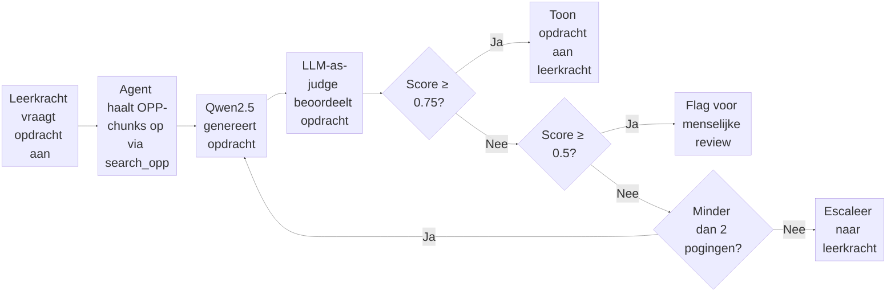

# LLM-as-Judge: Kwaliteitscontrole voor AI-gegenereerde opdrachten

Hoofdvraag:
Juf Aimee genereert een opdracht voor een leerling, maar hoe weet je of die opdracht goed genoeg is om aan het hoogbegaafde kind te geven? 

Zonder evaluatierubric: de judge-AI krijgt een opdracht en zegt vaag "dit is goed" of "dit is slecht", maar niemand weet waarom, en je kunt het niet controleren of verbeteren.

Met rubric: de judge-AI scoort de opdracht op 5 meetbare criteria (1–5), geeft per criterium een onderbouwing, en de beslislogica bepaalt automatisch wat er gebeurt. Transparant, controleerbaar, en uitlegbaar aan een leerkracht.

```
Juf Aimee genereert opdracht → Judge scoort op rubric → Beslislogica zegt goedkeuren / flaggen / opnieuw genereren → Leerkracht ziet het resultaat
```
## Evaluatiepipeline



---
### Judge prompt (Nog agmaken)
Example Prompt:
```
"You are an expert AI software architect auditing ..." 
```
### RAGAS 
Retrieval Augmented Generation Assesment

### Evaluatierubric opstellen

| # | Criterium | Type | Bron |
|---|---|---|---|
| 1 | Bevat de opdracht elementen die aansluiten op de interesses die in het leerlingprofiel staan? | Onderwijsspecifiek | Self-Determination Theory (Ryan & Deci, 2000) |
| 2 | Past de moeilijkheidsgraad van de opdracht bij het opgegeven Bloom-niveau van de leerling? | Onderwijsspecifiek | Bloom's Taxonomy (Anderson & Krathwohl, 2001) |
| 3 | Kan een leerling van deze leeftijd en dit niveau de opdracht zelfstandig uitvoeren? | Onderwijsspecifiek | Zone of Proximal Development (Vygotsky) |
| 4 | Sluit de opdracht aan bij de beginsituatie van de leerling, niet alleen bij het einddoel? | Onderwijsspecifiek | Roberts & Inman (2023) via Basisboek Hoogbegaafdheid H22 |
| 5 | Is de opdracht leeftijdspassend in taalgebruik, toon en inhoud voor dit kind? | Ethiek / Wetgeving | EU AI Act Art. 5 + AVG Art. 8 |
| 6 | Bevat de opdracht geen aannames of stereotypes op basis van geslacht, cultuur of achtergrond? | Ethiek / Wetgeving | EU AI Act Art. 10 + Gelijke Behandelingswet |
| 7 | Kan een leerkracht de opdracht makkelijk lezen, beoordelen en indien nodig aanpassen? | Ethiek / Wetgeving | EU AI Act Art. 14 |
| 8 | Zijn alle elementen in de opdracht terug te herleiden naar het leerlingprofiel, zonder verzonnen info? | RAGAS | Es et al., 2023 — faithfulness metric |
| 9 | Gebruikt de opdracht alleen relevante leerlinginfo en laat het irrelevante details weg? | RAGAS | Es et al., 2023 — context precision metric |
## Wetenschappelijke Bronnen

- **LLM-as-judge**: Zheng et al. (2023) — https://arxiv.org/abs/2306.05685
- **G-Eval**: Liu et al. (2023) — https://arxiv.org/abs/2303.16634
- **RAGAS**: Es et al. (2023) — https://arxiv.org/abs/2309.15217

- Basisboek (Hoog)begaafdheid voor po en vo: 
