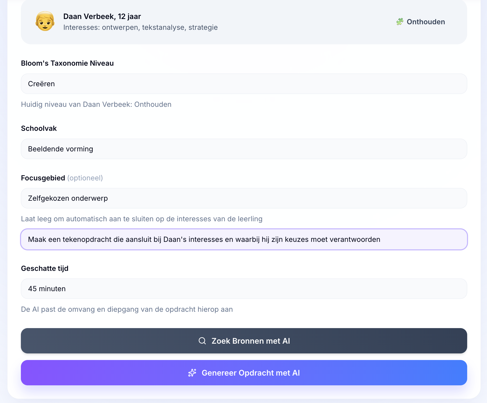
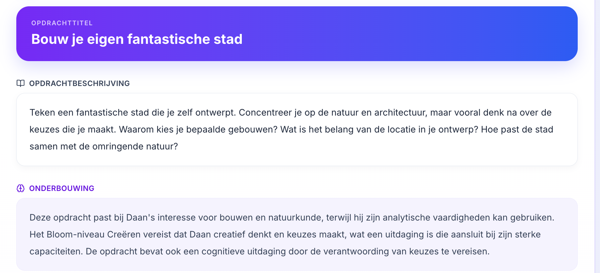
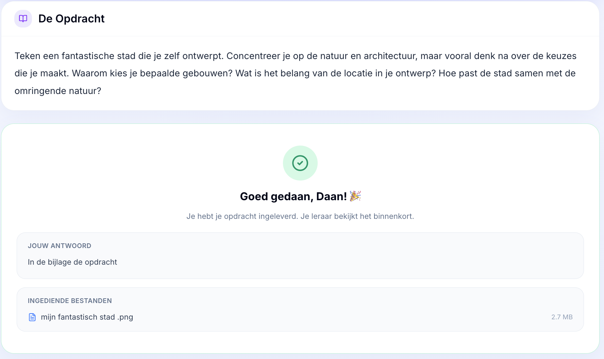
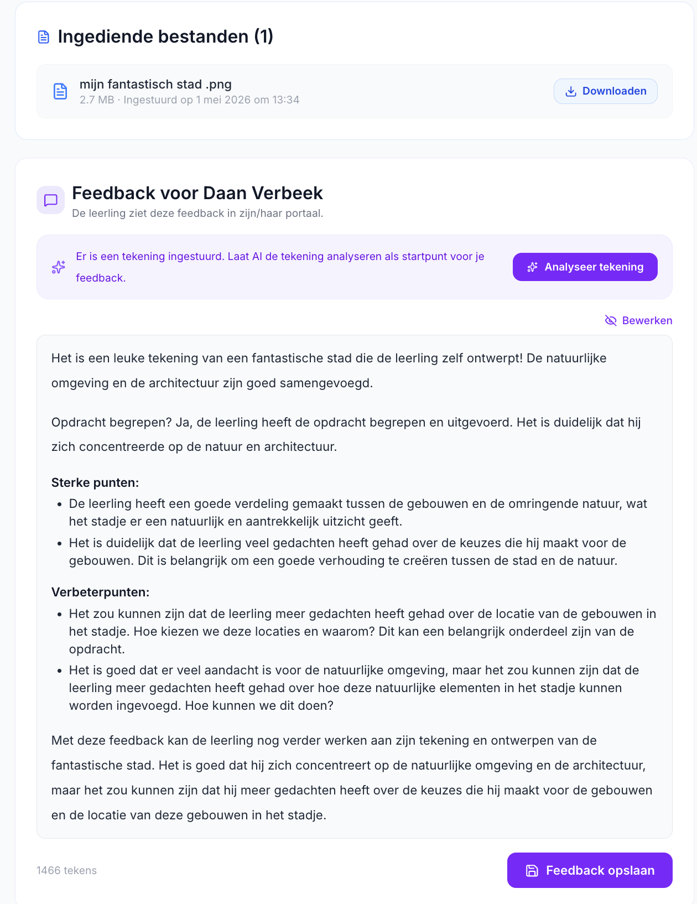

# Testplan: AI-tekeninganalyse 

**Datum:** 01-05-2026     
**Feature:** Leraar kan een ingestuurde tekening laten analyseren door LLaVA:7b, waarna een feedbacksuggestie verschijnt in de tekstbox.

---

## Voorbereiding

Zorg dat het volgende klaar staat voordat je begint:

- Ollama draait lokaal: `ollama list` toont `llava:7b`
- De applicatie draait: `npm run dev`
- Er is een testleerling met een opdracht in de database

---

## Stap 1 — Leerling levert tekening in

1. Log in als leerling
2. Open een opdracht
3. Upload een afbeelding (PNG of JPG) via het inleverformulier
4. Voeg eventueel een tekstantwoord toe
5. Klik op inleveren

**Verwacht:** succespagina verschijnt met "Goed gedaan!" en de bestandsnaam is zichtbaar

---

## Stap 2 — Leraar opent de ingeleverde opdracht

1. Log in als leraar
2. Navigeer naar de leerling → opdrachten
3. Open de ingeleverde opdracht

**Verwacht:**
- De ingeleverde tekening staat vermeld onder "Ingediende bestanden"
- De knop *"Analyseer tekening"* is zichtbaar in het feedbackformulier
- Er staat nog geen feedback in de tekstbox

---

## Stap 3 — Leraar analyseert de tekening

1. Klik op *"Analyseer tekening"*

**Verwacht tijdens het analyseren:**
- Knop toont "Analyseren…" met een laadspinner
- Knop is uitgeschakeld (niet klikbaar)

**Verwacht na het analyseren:**
- De tekstbox is gevuld met een feedbacksuggestie
- De suggestie bevat deze vier onderdelen:
  - `Wat is er te zien?`
  - `Opdracht begrepen?`
  - `Sterke punten:`
  - `Verbeterpunten:`

---

## Stap 4 — Leraar past de feedback aan en slaat op

1. Pas de gegenereerde tekst aan naar eigen inzicht
2. Klik op **"Feedback opslaan"**

**Verwacht:** groene melding "Feedback opgeslagen — zichtbaar voor [naam leerling]"

---

## Stap 5 — Controleer dat de knop niet meer verschijnt

1. Ververs de pagina

**Verwacht:** de knop "Analyseer tekening" is **niet** meer zichtbaar (er is al feedback opgeslagen)

## Testresultaat

*Opdracht genereren*

*Opdrachtomschrijving*

*Ingestuurde assignment leerling*

*tekening leerling*

*Gegenereerde feedback voor leraar*

---

## Randgevallen om ook te testen

| Situatie | Wat te doen | Verwacht |
|----------|-------------|----------|
| Leerling levert een PDF in | Upload een `.pdf` bestand | Knop "Analyseer tekening" verschijnt **niet** |
| Ollama staat uit | Stop Ollama, klik op de analyseknop | Rode foutmelding verschijnt, app crasht niet |
| Lege feedback opslaan | Leeg de tekstbox, klik opslaan | Knop blijft uitgeschakeld, niets wordt opgeslagen |
