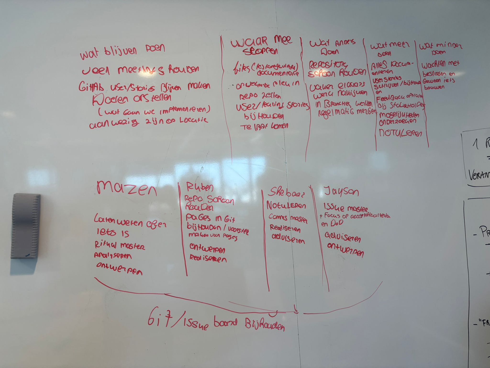

# Retrospective Verslag — Sprint 1

**Datum:** 18-03-2026  
**Aanwezig:** Jayson, Ruben, Shehbaaz, Mazen  

---

## 2. Wat moeten we **blijven** doen?

- Veel meetings houden
- GitLab userstories blijven maken, kaders opstellen (wat gaan we implementeren)
- Aanwezig zijn op locatie

---

## 3. Waar moeten we mee **stoppen**?

- Files (te) korte/onduidelijke documentatie
- Onwerkende delen in repo zetten
- Userstories / Learning stories bijhouden te laat komen

---

## 4. Wat moeten we **anders** doen?

- Repository schoon houden
- Elkaars elkaars werk nallijken in branches, regelmatig mergen

---

## 5. Wat moeten we **meer** doen?

- Alles documenteren
- Userstories schrijven/bijhouden
- Feedback ophalen bij stakeholders
- Mogelijkheden onderzoeken
- Notuleren

---

## 6. Wat moeten we **minder** doen?

- Wachten met beslissen en gewoon iets bouwen

---

## Persoonlijke Retro-acties komende sprint

> Elke actie wordt ook als issue aangemaakt op het board met labels **Retro-actie** en **US**, toegekend aan de juiste persoon.

| Teamlid | Rol Sprint 3 | Persoonlijk leerdoel (Persoonlijk Leiderschap) | Actie komende sprint | Issue link |
|--------|-------------|----------------------------------------------|----------------------|------------|
| **Mazen** | Ritual Master | Analyseren, Ontwerpen | Laten weten over iets, Analyseren, Ontwerpen | [#issue] |
| **Ruben** | Communication Master | Ontwerpen, Realiseren | Repo screen bijhouden, Pages in Git bijhouden, Ontwerpen, Realiseren | [#issue] |
| **Shehbaaz** | Communication Master | Realiseren, Adviseren | Notuleren, Realiseren, Adviseren | [#issue] |
| **Jayson** | Issue Master | Adviseren, Ontwerpen | Focus op acceptatiecriteria en DoD, Adviseren, Ontwerpen | [#issue] |

---

